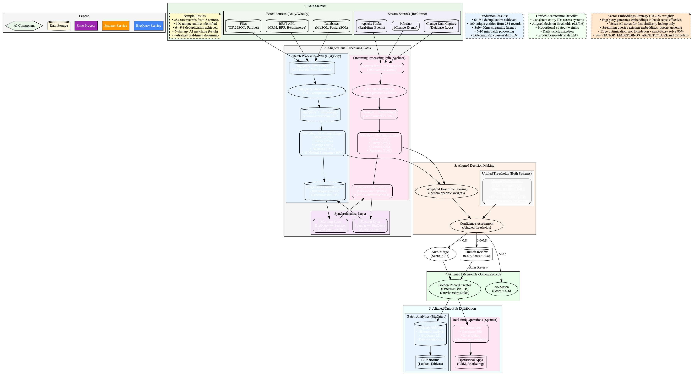
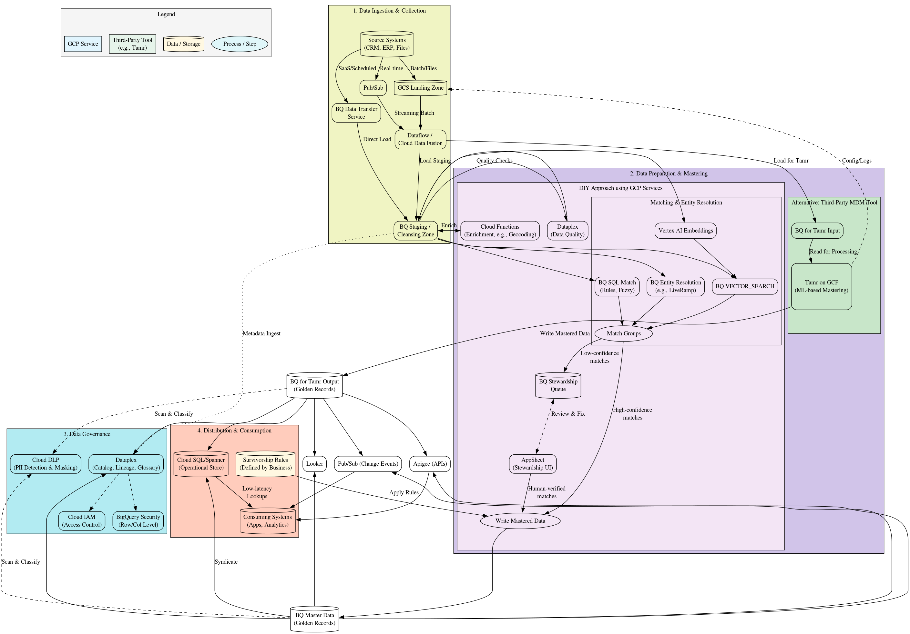
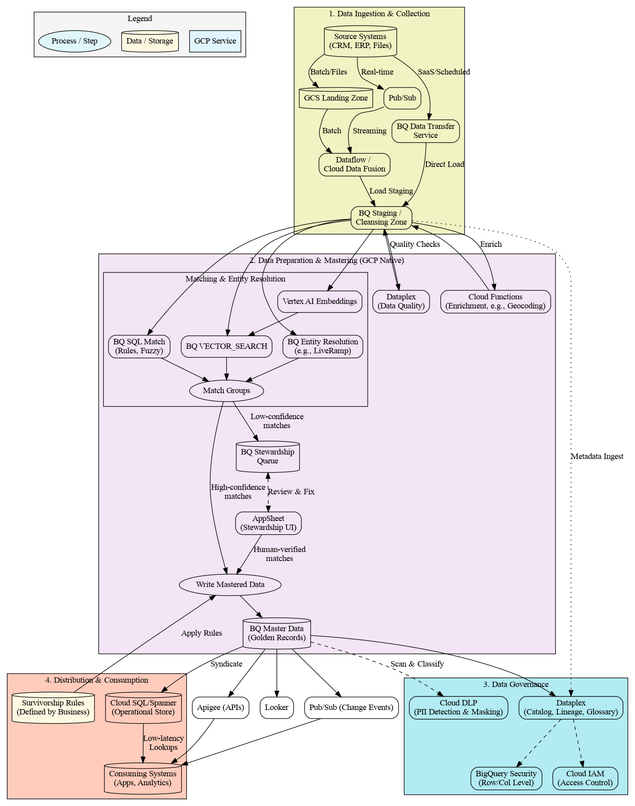
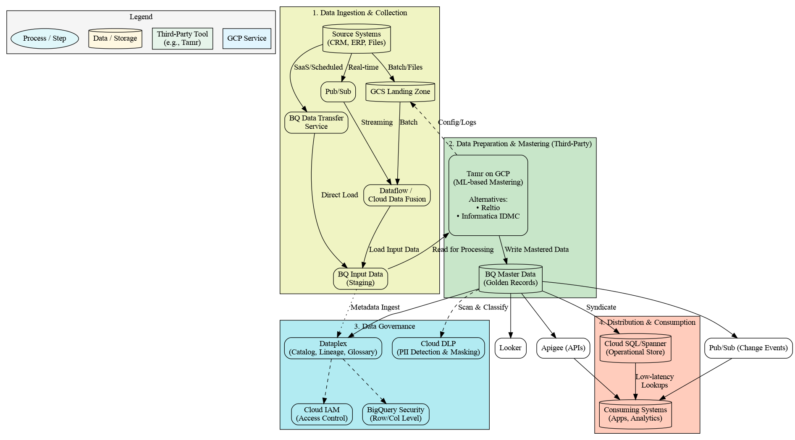

# Master Data Management (MDM) on Google Cloud Platform

A comprehensive, production-ready MDM solution demonstrating both **batch** and **streaming** processing paths using native GCP services with AI-powered entity resolution.

## 🚀 Quick Start

Choose your implementation path:

- **📊 [Batch Processing Guide](./batch_mdm_gcp/MDM_BATCH_PROCESSING.md)** - Complete 5-strategy implementation using BigQuery
- **⚡ [Streaming Processing Guide](./streaming_mdm_gcp/MDM_STREAMING_PROCESSING.md)** - Real-time 4-strategy implementation using Spanner
- **🔄 [Unified Implementation Guide](./mdm_unified_implementation.md)** - Production-ready aligned architecture

## 📚 Implementation Guides

### **Batch Processing (BigQuery)**
- **📓 [Interactive Notebook](./batch_mdm_gcp/mdm_batch_processing.ipynb)** - Step-by-step implementation
- **📋 [Complete Setup Guide](./batch_mdm_gcp/MDM_BATCH_PROCESSING.md)** - Prerequisites, configuration, troubleshooting
- **📈 [Results & Demo Materials](./batch_mdm_gcp/MDM_BATCH_RESULTS.md)** - Performance metrics, visualizations, demo scripts

### **Streaming Processing (Spanner)**
- **📓 [Interactive Notebook](./streaming_mdm_gcp/streaming_mdm_processing.ipynb)** - Real-time processing demo
- **📋 [Complete Setup Guide](./streaming_mdm_gcp/MDM_STREAMING_PROCESSING.md)** - Spanner configuration, optimization

### **Unified Architecture**
- **🔄 [Unified Implementation](./mdm_unified_implementation.md)** - Aligned batch + streaming architecture
- **🎯 [Architecture Overview](#architecture-overview)** - Visual diagrams and design decisions

## 📊 Results & Performance

| Metric | Batch (BigQuery) | Streaming (Spanner) |
|--------|------------------|---------------------|
| **Processing Time** | 5-10 minutes | Sub-400ms |
| **Strategies** | 5 (with AI) | 4 (optimized) |
| **Deduplication** | 64.8% (284→100) | Real-time updates |
| **Thresholds** | Auto: ≥0.8, Review: 0.6-0.8 | Aligned thresholds |
| **Use Case** | Analytics, ML | Operational apps |

## 🏗️ Architecture Overview

### Core Architectures

**Unified Batch + Streaming Architecture** - Production-ready aligned implementation

### Additional Views
-  - **Complete MDM** (DIY + 3rd-party approaches)
-  - **GCP Native** (DIY approach only)
-  - **Third-Party** integration patterns

## 💻 Code & Utilities

### **Python Packages**
- **🔧 [BigQuery Utilities](./batch_mdm_gcp/bigquery_utils.py)** - SQL generation, BigQuery helpers
- **🔧 [Spanner Utilities](./streaming_mdm_gcp/spanner_utils.py)** - Spanner operations, optimization
- **🔧 [Streaming Processor](./streaming_mdm_gcp/streaming_processor.py)** - 4-strategy matching engine
- **🔧 [Data Generator](./batch_mdm_gcp/data_generator.py)** - Realistic test data generation

### **Interactive Notebooks**
- **📓 [Batch Processing](./batch_mdm_gcp/mdm_batch_processing.ipynb)** - Complete 5-strategy pipeline
- **📓 [Streaming Processing](./streaming_mdm_gcp/streaming_mdm_processing.ipynb)** - Real-time matching demo

## 🧮 Vector Embeddings Strategy

**⚠️ Important**: Vector embeddings are powerful but should only be **10-20% of your MDM strategy**.
Exact and fuzzy matching solve 80% of problems at 1% of the cost.

### Quick Guidelines
- **Start Simple**: Implement exact + fuzzy matching first (solves 70-80% of cases)
- **Measure ROI**: Only add vectors if they demonstrably improve match rates
- **Batch Generate**: Use BigQuery for cost-effective embedding generation (10x cheaper)
- **Right-size Weights**: Vectors should be 10-20% of total strategy, not the foundation

👉 **[Read the Complete Vector Embeddings Architecture Guide](./VECTOR_EMBEDDINGS_ARCHITECTURE.md)** for production implementation details, cost analysis, and decision framework.

## 🎯 Key Features

### **5-Strategy AI Matching (Batch)**
- ⚡ **Exact Matching** (30%) - Email, phone, ID
- 🔍 **Fuzzy Matching** (25%) - Name, address similarity
- 🧮 **Vector Matching** (20%) - Semantic similarity with Gemini embeddings
- 📋 **Business Rules** (15%) - Domain-specific logic
- 🤖 **AI Natural Language** (10%) - Gemini 2.5 Pro reasoning

### **4-Strategy Real-time Matching (Streaming)**
- ⚡ **Exact Matching** (33%) - Proportionally adjusted
- 🔍 **Fuzzy Matching** (28%) - Real-time string similarity
- 🧮 **Vector Matching** (22%) - Cached embeddings
- 📋 **Business Rules** (17%) - Low-latency rules

### **Unified Configuration**
- 🎯 **Aligned Thresholds** - Auto-merge: ≥0.8, Human review: 0.6-0.8
- 🔑 **Deterministic IDs** - Same entity gets same ID across systems
- 🔄 **Daily Synchronization** - BigQuery ↔ Spanner data flow
- 📊 **Production Monitoring** - Comprehensive metrics and alerting

## 🚀 Use Cases

- **🏦 Banking** - Customer 360, risk management, KYC/AML
- **🛒 Retail** - Product catalogs, customer personalization
- **🏥 Healthcare** - Patient records, provider networks
- **✈️ Travel** - Inventory deduplication, supplier management
- **🏭 Manufacturing** - Supplier data, product standardization

## 📖 External Resources

- [BigQuery ML Documentation](https://cloud.google.com/bigquery-ml/docs)
- [Spanner Documentation](https://cloud.google.com/spanner/docs)
- [Vertex AI Embeddings](https://cloud.google.com/vertex-ai/docs/generative-ai/embeddings/get-text-embeddings)
- [BigQuery Vector Search](https://cloud.google.com/bigquery/docs/vector-search-intro)

---

**Ready for Production MDM! 🎯**

Choose your path: [Batch](./batch_mdm_gcp/MDM_BATCH_PROCESSING.md) | [Streaming](./streaming_mdm_gcp/MDM_STREAMING_PROCESSING.md) | [Unified](./mdm_unified_implementation.md)
