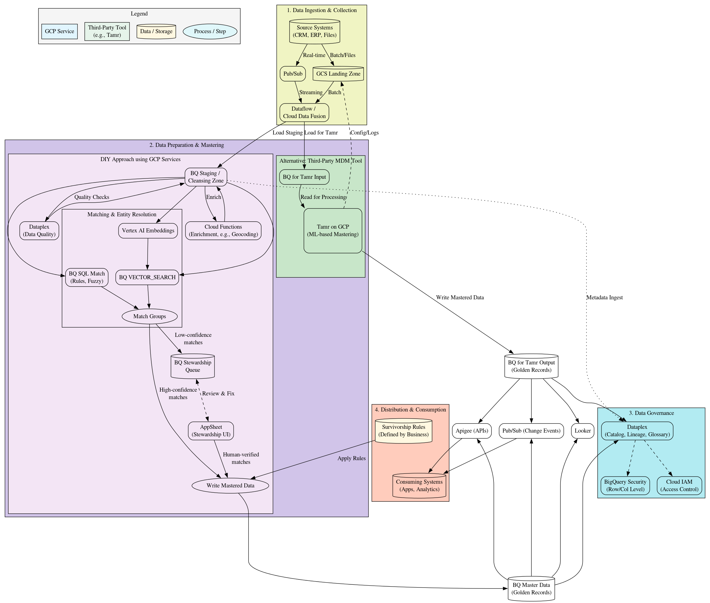

# Modern MDM Architecture on Google Cloud

## Overview

This repository contains a comprehensive architectural blueprint for building a modern Master Data Management (MDM) solution on the Google Cloud (GCP) stack. It provides a visual guide and Graphviz source code to illustrate the end-to-end data lifecycle required to create a "golden record" for core business entities (e.g., Customer, Product).

The primary goal of this architecture is to solve the "single source of truth" problem by detailing two distinct paths:
1.  **A "Build" (DIY) Approach:** Using 100% native GCP services, including modern ML-based entity resolution.
2.  **A "Buy" (3rd-Party) Approach:** Showing how to integrate a specialized MDM tool (like Tamr, Reltio, or Informatica) into the GCP ecosystem.

This document serves as an entry point for data architects, data engineers, and platform owners looking to design and implement MDM on GCP.

## Architecture Diagram

Below is the rendered architecture. You can generate an up-to-date version of this image at any time using the `mdm_architecture.dot` file.

*(You will need to generate this image and place it here. A good name would be `mdm_architecture.png`)*



## Table of Contents

- [Core Architectural Concepts](#core-architectural-concepts)
- [Key Design Decisions](#key-design-decisions)
- [How to Generate the Diagram](#how-to-generate-the-diagram)
- [Component Glossary (GCP Services)](#component-glossary-gcp-services)
- [Contributing](#contributing)

## Core Architectural Concepts

The architecture is broken into four main conceptual blocks, representing the complete data lifecycle:

1.  **Data Ingestion & Collection (Block 1):** This stage covers ingesting data from all source systems (e.g., CRMs, ERPs, files) into Google Cloud. It shows patterns for both real-time (via `Pub/Sub`) and batch (via `GCS Landing Zone`) data, which is then processed by `Dataflow` or `Cloud Data Fusion`.
2.  **Data Preparation & Mastering (Block 2):** This is the core of the solution and visualizes the main "Build vs. Buy" decision.
    -   The **DIY Path (pink)** uses native GCP services to perform data quality checks, cleansing, matching, and survivorship.
    -   The **3rd-Party Path (green)** shows data being loaded into BigQuery and then read by a tool like Tamr, which performs the mastering and writes its output back to BigQuery.
3.  **Data Governance (Block 3):** Once the golden records are created (by either path), this block shows how they are governed. `Dataplex` is used to create a unified data catalog, track lineage, and manage business glossaries. `Cloud IAM` and `BigQuery Security` enforce access control.
4.  **Distribution & Consumption (Block 4):** This final stage shows how the mastered data is used. It covers both:
    -   **Analytical Consumption:** `Looker` (or any BI tool) for reporting.
    -   **Operational Consumption:** `Apigee` (for API access) and `Pub/Sub` (for real-time change data capture events).

## Key Design Decisions

This architecture is not just a list of services; it represents several key design decisions.

### 1. "Build" (DIY) vs. "Buy" (3rd-Party)

The diagram's central feature is the parallel representation of the two main MDM strategies. This allows teams to evaluate the trade-offs between a fully custom, native solution and a licensed, out-of-the-box platform.

### 2. State-of-the-Art DIY Stack

The "DIY Approach" is not just simple SQL rules. It represents a modern, ML-driven framework:
* **Vector Search:** It explicitly uses `Vertex AI Embeddings` and `BQ VECTOR_SEARCH` for advanced, probabilistic entity resolution. This allows for "fuzzy matching" on names, addresses, and other attributes at scale.
* **Rules Engine:** It combines this ML approach with a traditional `BQ SQL Match` for deterministic rules (e.g., matching on a verified email or tax ID).

### 3. The "Human-in-the-Loop" Stewardship Process

A fully automated MDM is unrealistic. The "DIY" path explicitly includes a critical feedback loop for data stewardship:
* **Queue:** Low-confidence matches are routed to a `BQ Stewardship Queue`.
* **UI:** An `AppSheet` (or Looker/custom web app) is used as a "Stewardship UI" for a human to review and manually approve or reject matches.
* **Feedback:** These human-verified decisions are fed back into the `Write Mastered Data` process, ensuring data accuracy. This loop is the most critical part of a successful DIY build.

### 4. Decoupled Survivorship Logic

Survivorship (the rules that decide which source "wins" for each data field) is treated as a separate configuration input (`Survivorship Rules`). This logic is applied at the final `Write Mastered Data` step, making it easy to update the business rules without re-engineering the entire matching pipeline.

## How to Generate the Diagram

### Prerequisites

You must have [Graphviz](https://graphviz.org/download/) installed on your local machine. This provides the `dot` command-line tool.

### Instructions

The repository contains the `mdm_architecture.dot` source file. You can generate the diagram image using the following commands from your terminal:

**To generate a PNG image:**
```bash
dot -Tpng mdm_architecture.dot -o mdm_architecture.png