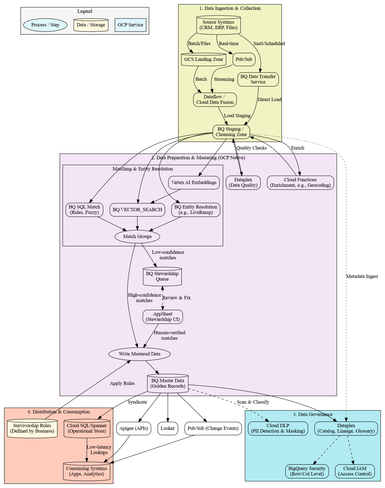
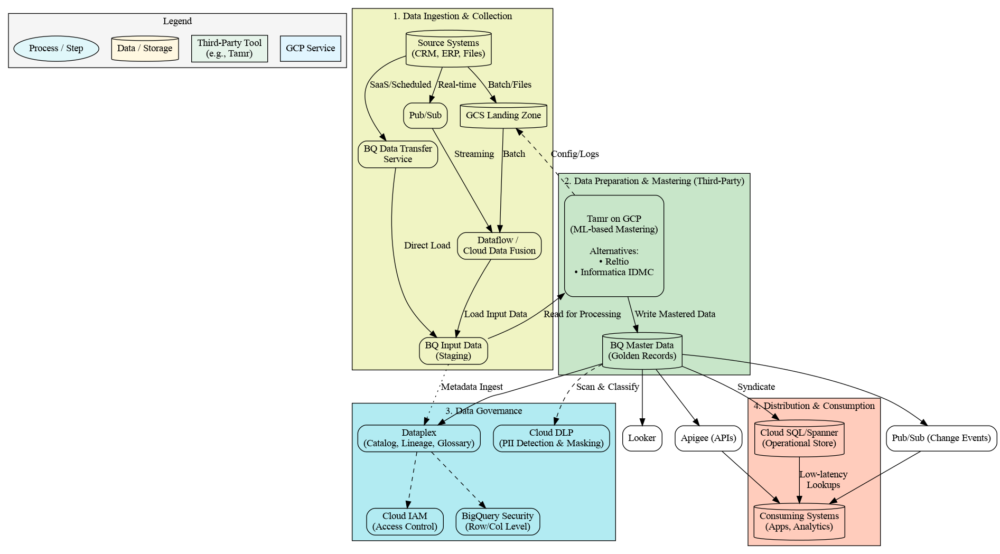

# Modern MDM Architecture on Google Cloud

## Overview

This repository contains a comprehensive architectural blueprint for building a modern Master Data Management (MDM) solution on the Google Cloud (GCP) stack. It provides a visual guide and Graphviz source code to illustrate the end-to-end data lifecycle required to create a "golden record" for core business entities (e.g., Customer, Product).

The primary goal of this architecture is to solve the "single source of truth" problem by detailing two distinct paths:
1.  **A "Build" (DIY) Approach:** Using 100% native GCP services, including modern ML-based entity resolution.
2.  **A "Buy" (3rd-Party) Approach:** Showing how to integrate a specialized MDM tool (like Tamr, Reltio, or Informatica) into the GCP ecosystem.

This document serves as an entry point for data architects, data engineers, and platform owners looking to design and implement MDM on GCP.

## Why Master Data Management?

Master Data Management addresses the fundamental challenge of data fragmentation across enterprise systems. Organizations typically struggle with:

- **Multiple versions of the same entity** across different systems (e.g., the same customer with different names, addresses, or IDs)
- **Inconsistent data quality** leading to poor decision-making and operational inefficiencies
- **Manual reconciliation efforts** that are time-consuming and error-prone
- **Compliance risks** from inaccurate or incomplete data

MDM creates a **single source of truth** for critical business entities, enabling:
- **Improved Decision Making:** Reliable analytics based on consistent, accurate data
- **Operational Efficiency:** Reduced errors in customer service, billing, and fulfillment
- **Enhanced Customer Experience:** 360-degree view enabling personalization and better service
- **Regulatory Compliance:** Accurate data for reporting and audit requirements
- **Cost Reduction:** Elimination of manual data reconciliation and duplicate processing

### Common Use Cases

- **Customer 360:** Unifying customer data from CRM, e-commerce, support systems, and marketing platforms
- **Product Master:** Consolidating product information from multiple suppliers, catalogs, and inventory systems
- **Supplier Management:** Creating consistent supplier records across procurement, finance, and operations
- **Location Hierarchy:** Standardizing geographic and organizational hierarchies across business units
- **Healthcare:** Patient record consolidation across multiple healthcare providers and systems
- **Travel Industry:** Hotel room deduplication between suppliers (e.g., Booking.com, Expedia, direct feeds)

## Architecture Diagrams

This repository includes three architectural views to help you understand different implementation approaches:

### 1. Complete Architecture (Both Approaches)
Shows both DIY and Third-Party approaches side-by-side for comparison:


### 2. GCP Native Architecture (DIY Approach)
Focuses exclusively on the DIY approach using only GCP services:



### 3. Third-Party Architecture (Tamr/Reltio/Informatica)
Shows integration with third-party MDM tools:



## Table of Contents

- [Core Architectural Concepts](#core-architectural-concepts)
- [Key Design Decisions](#key-design-decisions)
- [How to Generate the Diagram](#how-to-generate-the-diagram)
- [Component Glossary (GCP Services)](#component-glossary-gcp-services)

## Core Architectural Concepts

The architecture is broken into four main conceptual blocks, representing the complete data lifecycle:

1.  **Data Ingestion & Collection (Block 1):** This stage covers ingesting data from all source systems into Google Cloud with multiple ingestion patterns:
    -   **Real-time:** `Pub/Sub` for streaming data from applications and IoT devices
    -   **Batch/Files:** `GCS Landing Zone` for file-based data (CSV, JSON, Parquet)
    -   **SaaS/Scheduled:** `BQ Data Transfer Service` for managed ingestion from SaaS applications (Salesforce, Google Ads, etc.)
    -   **Processing:** `Dataflow` or `Cloud Data Fusion` for ETL/ELT transformations

2.  **Data Preparation & Mastering (Block 2):** This is the core of the solution and visualizes the main "Build vs. Buy" decision:
    -   **DIY Path (pink):** Uses native GCP services including `BigQuery` for staging, `Dataplex` for data quality, multiple matching strategies (SQL rules, Vector Search, Entity Resolution Framework), and a human-in-the-loop stewardship process via `AppSheet`
    -   **3rd-Party Path (green):** Shows data being loaded into BigQuery and processed by specialized MDM tools like `Tamr`, which perform ML-based mastering and write results back to BigQuery

3.  **Data Governance (Block 3):** Comprehensive governance layer that applies to both DIY and third-party approaches:
    -   **Cataloging & Lineage:** `Dataplex` creates unified data catalog and tracks data lineage
    -   **Access Control:** `Cloud IAM` and `BigQuery Security` (row/column level security)
    -   **Privacy & Compliance:** `Cloud DLP` for PII detection, classification, and masking

4.  **Distribution & Consumption (Block 4):** Multiple consumption patterns for different use cases:
    -   **Analytics:** `Looker` for business intelligence and reporting
    -   **APIs:** `Apigee` for secure, managed API access to master data
    -   **Event-Driven:** `Pub/Sub` for real-time change notifications
    -   **Operational Systems:** `Cloud SQL/Spanner` for low-latency transactional lookups

## Key Design Decisions

This architecture is not just a list of services; it represents several key design decisions.

### 1. "Build" (DIY) vs. "Buy" (3rd-Party)

The diagram's central feature is the parallel representation of the two main MDM strategies. This allows teams to evaluate the trade-offs between a fully custom, native solution and a licensed, out-of-the-box platform.

### 2. State-of-the-Art DIY Stack

The "DIY Approach" is not just simple SQL rules. It represents a modern, ML-driven framework with multiple matching strategies:

* **Traditional Rules Engine:** `BQ SQL Match` for deterministic rules (e.g., exact matches on email, tax ID, or phone numbers)
* **Vector Search:** `Vertex AI Embeddings` combined with `BQ VECTOR_SEARCH` for advanced, probabilistic entity resolution. This generates numerical embeddings for text attributes like names and addresses, enabling "fuzzy matching" that's resilient to typos and variations
* **Third-Party Identity Resolution:** `BQ Entity Resolution Framework` (e.g., LiveRamp integration) provides access to external identity graphs without moving your data outside BigQuery
* **Data Enrichment:** `Cloud Functions` for calling external APIs (geocoding, company data providers) and `Vertex AI` for ML-based enrichment
* **Quality Assurance:** `Dataplex Data Quality` for automated data validation and monitoring

### 3. The "Human-in-the-Loop" Stewardship Process

A fully automated MDM is unrealistic. The "DIY" path explicitly includes a critical feedback loop for data stewardship:
* **Queue:** Low-confidence matches are routed to a `BQ Stewardship Queue`.
* **UI:** An `AppSheet` (or Looker/custom web app) is used as a "Stewardship UI" for a human to review and manually approve or reject matches.
* **Feedback:** These human-verified decisions are fed back into the `Write Mastered Data` process, ensuring data accuracy. This loop is the most critical part of a successful DIY build.

### 4. Decoupled Survivorship Logic

Survivorship (the rules that decide which source "wins" for each data field) is treated as a separate configuration input (`Survivorship Rules`). This logic is applied at the final `Write Mastered Data` step, making it easy to update the business rules without re-engineering the entire matching pipeline.

## How to Generate the Diagrams

### Prerequisites

You must have [Graphviz](https://graphviz.org/download/) installed on your local machine. This provides the `dot` command-line tool.

### Instructions

The repository contains three DOT source files. You can generate the diagram images using the following commands from your terminal:

**To generate all PNG images:**
```bash
# Complete architecture (both approaches)
dot -Tpng mdm_architecture.dot -o mdm_architecture.png

# GCP Native (DIY) architecture
dot -Tpng mdm_architecture_gcp.dot -o mdm_architecture_gcp.png

# Third-Party architecture
dot -Tpng mdm_architecture_3pt.dot -o mdm_architecture_3pt.png
```

**To generate all SVG images:**
```bash
# Complete architecture (both approaches)
dot -Tsvg mdm_architecture.dot -o mdm_architecture.svg

# GCP Native (DIY) architecture
dot -Tsvg mdm_architecture_gcp.dot -o mdm_architecture_gcp.svg

# Third-Party architecture
dot -Tsvg mdm_architecture_3pt.dot -o mdm_architecture_3pt.svg
```

**To generate all diagrams at once:**
```bash
# Generate all PNG files
for file in mdm_architecture*.dot; do
    dot -Tpng "$file" -o "${file%.dot}.png"
done
```

## Component Glossary (GCP Services)

### Data Ingestion & Collection
- **Cloud Storage (GCS):** Object storage for staging raw data files from various sources
- **Pub/Sub:** Real-time messaging service for streaming data ingestion
- **Dataflow:** Serverless stream and batch data processing service for ETL/ELT pipelines
- **Cloud Data Fusion:** Visual data integration service with drag-and-drop interface
- **BigQuery Data Transfer Service:** Managed service for scheduled data imports from SaaS applications

### Data Processing & Mastering
- **BigQuery:** Serverless data warehouse serving as the central repository for staging and master data
- **Dataplex:** Unified data management service providing data quality, cataloging, and governance
- **Cloud Functions:** Event-driven serverless compute for data enrichment and lightweight processing
- **Vertex AI:** Machine learning platform for embeddings generation and custom model training
- **AppSheet:** No-code application platform for building data stewardship interfaces

### Matching & Entity Resolution
- **BigQuery SQL:** Native SQL capabilities for rule-based matching and fuzzy logic
- **BigQuery Vector Search:** Semantic similarity search using ML embeddings
- **BigQuery Entity Resolution Framework:** Integration with third-party identity providers (e.g., LiveRamp)
- **Vertex AI Embeddings:** Text embedding models for semantic matching

### Data Governance & Security
- **Cloud IAM:** Identity and access management for fine-grained permissions
- **BigQuery Security:** Row-level and column-level security controls
- **Cloud DLP:** Data loss prevention for PII detection, classification, and masking
- **Dataplex Catalog:** Metadata management, data lineage, and business glossary

### Distribution & Consumption
- **Looker:** Business intelligence platform for analytics and reporting
- **Apigee:** API management platform for secure data access
- **Pub/Sub:** Event streaming for real-time change notifications
- **Cloud SQL/Spanner:** Relational databases for operational data stores requiring low-latency access

### Third-Party Integration Examples
- **Tamr:** ML-powered data mastering platform that runs on GCP infrastructure
- **Reltio:** Cloud-native MDM platform with deep BigQuery integration
- **Informatica IDMC:** Comprehensive data management suite with GCP connectors

## Migration from Legacy MDM Systems

Organizations migrating from on-premise MDM solutions (such as IBM InfoSphere MDM) should consider:

### Assessment Phase
1. **Current State Analysis:** Document existing data models, business rules, and integration points
2. **Rule Migration:** Catalog matching rules, survivorship logic, and data quality checks
3. **Integration Mapping:** Identify all upstream sources and downstream consumers

### Migration Strategies
- **Phased Approach:** Migrate one data domain at a time (e.g., Customer, then Product)
- **Parallel Run:** Operate both systems temporarily to validate results
- **Rule Translation:** Convert legacy business rules to BigQuery SQL or partner tool configurations

### GCP Advantages Over Legacy Systems
- **Scalability:** Handle larger data volumes without infrastructure constraints
- **Cost Efficiency:** Pay-as-you-go model vs. large upfront licensing costs
- **Modern ML Capabilities:** Advanced matching using embeddings and vector search
- **Cloud-Native Integration:** Seamless connectivity with other cloud services and SaaS applications
