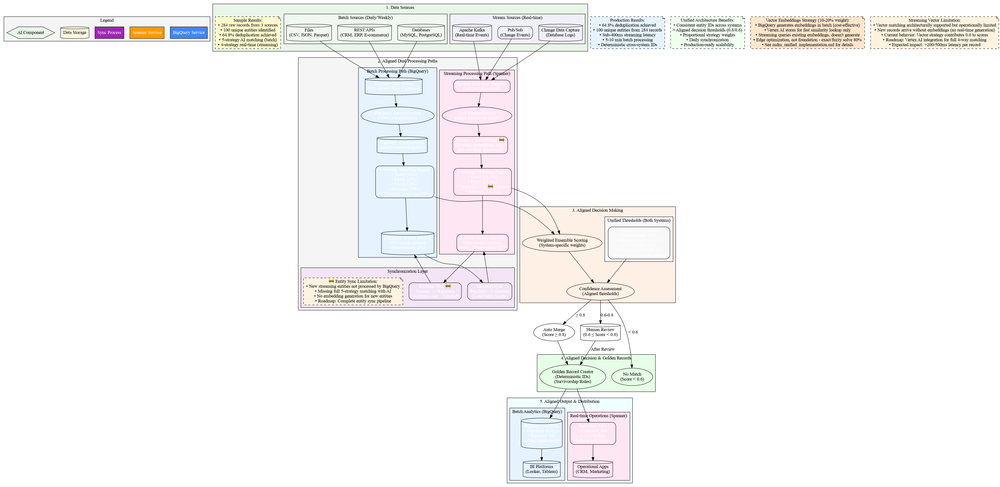

# Master Data Management (MDM) on Google Cloud Platform

A comprehensive, production-ready MDM solution demonstrating both **batch** and **streaming** processing paths using native GCP services with AI-powered entity resolution.

## 🚀 Quick Start

### **📚 Choose Your Path**

| Goal | Recommended Path | Description |
|------|------------------|-------------|
| **🎯 Strategic Overview** | [Unified Implementation Guide](./mdm_unified_implementation.md) | Complete architecture framework, limitations, roadmap |
| **📊 Batch Implementation** | [Batch Processing Guide](./batch_mdm_gcp/MDM_BATCH_PROCESSING.md) | 5-strategy BigQuery implementation with AI |
| **⚡ Streaming Implementation** | [Streaming Processing Guide](./streaming_mdm_gcp/MDM_STREAMING_PROCESSING.md) | 4-strategy Spanner real-time processing |
| **🔍 Quick Demo** | [Interactive Notebooks](#interactive-notebooks) | Hands-on exploration and testing |
| **🏗️ Architecture Deep Dive** | [Architecture Diagrams](#architecture-diagrams) | Visual representations and design patterns |

### **🎯 New to MDM?**
1. **Start Here**: [Unified Implementation Guide](./mdm_unified_implementation.md) - Strategic framework and vector strategy
2. **Then Choose**: [Batch](./batch_mdm_gcp/MDM_BATCH_PROCESSING.md) for analytics or [Streaming](./streaming_mdm_gcp/MDM_STREAMING_PROCESSING.md) for real-time
3. **Explore**: [Interactive Notebooks](#interactive-notebooks) for hands-on experience

## 📚 Implementation Guides

### **Batch Processing (BigQuery)**
- **📓 [Interactive Notebook](./batch_mdm_gcp/mdm_batch_processing.ipynb)** - Step-by-step implementation
- **📋 [Complete Setup Guide](./batch_mdm_gcp/MDM_BATCH_PROCESSING.md)** - Prerequisites, configuration, troubleshooting
- **📈 [Results & Demo Materials](./batch_mdm_gcp/MDM_BATCH_RESULTS.md)** - Performance metrics, visualizations, demo scripts

### **Streaming Processing (Spanner)**
- **📓 [Interactive Notebook](./streaming_mdm_gcp/streaming_mdm_processing.ipynb)** - Real-time processing demo
- **📋 [Complete Setup Guide](./streaming_mdm_gcp/MDM_STREAMING_PROCESSING.md)** - Spanner configuration, optimization

### **Unified Architecture**
- **🔄 [Unified Implementation](./mdm_unified_implementation.md)** - Aligned batch + streaming architecture
- **🎯 [Architecture Overview](#architecture-overview)** - Visual diagrams and design decisions

## 🏛️ Architectural Deep Dives & Comparisons

For a deeper understanding of the architectural decisions and comparisons against other systems, see these guides.

-   **[BigQuery vs. Traditional MDM](./batch_mdm_gcp/MDM_BATCH_COMPARISON.md)**: A detailed comparison showing how the BigQuery-native approach replaces each component of a traditional, siloed MDM stack (e.g., Informatica, IBM).
-   **[The Streaming Journey](./streaming_mdm_gcp/MDM_STREAMING_JOURNEY.md)**: A step-by-step guide to the streaming architecture, explaining the speed vs. accuracy trade-offs and the hybrid synchronization patterns.
-   **[Presentation Overview](./presentation.md)**: A high-level presentation-style document summarizing the project's goals, architecture, and key features.

## 🏗️ Architecture Overview

### **🎨 Architecture Diagrams**

**Unified Batch + Streaming Architecture** - Production-ready aligned implementation

#### **Diagram Sources**
- **🔄 [Unified Architecture Diagram](./mdm_unified_matching.dot)** - Complete visual representation (Graphviz source)
- **📊 [PNG Export](./images/mdm_unified_matching.png)** - Ready-to-use image

## 🚧 **Current Limitations & Roadmap**

**Important**: The streaming implementation has limitations that affect the unified architecture:

### **Key Limitations**
- 🚧 **Vector Matching**: New streaming records arrive without embeddings (no real-time generation)
- 🚧 **Entity Sync**: New streaming entities not processed by BigQuery batch pipeline
- **Impact**: Effective 3.x-way matching vs intended 4-way matching

### **Roadmap**
- **Streaming**: Full 4-way matching + complete entity sync pipeline

👉 **[Read Complete Limitations & Roadmap](./mdm_unified_implementation.md#current-streaming-limitations)** for detailed technical analysis and enhancement plans.

## 💻 Code & Utilities

### **Python Packages**
- **🔧 [BigQuery Utilities](./batch_mdm_gcp/bigquery_utils.py)** - SQL generation, BigQuery helpers
- **🔧 [Spanner Utilities](./streaming_mdm_gcp/spanner_utils.py)** - Spanner operations, optimization
- **🔧 [Streaming Processor](./streaming_mdm_gcp/streaming_processor.py)** - 4-strategy matching engine
- **🔧 [Data Generator](./batch_mdm_gcp/data_generator.py)** - Realistic test data generation

### **Interactive Notebooks**
- **📓 [Batch Processing](./batch_mdm_gcp/mdm_batch_processing.ipynb)** - Complete 5-strategy pipeline
- **📓 [Streaming Processing](./streaming_mdm_gcp/streaming_mdm_processing.ipynb)** - Real-time matching demo

## 🧮 Vector Embeddings Strategy

**⚠️ Important**: Vector embeddings are powerful but should only be **10-20% of your MDM strategy**.
Exact and fuzzy matching solve 80% of problems at 1% of the cost.

### Quick Guidelines
- **Start Simple**: Implement exact + fuzzy matching first (solves 70-80% of cases)
- **Measure ROI**: Only add vectors if they demonstrably improve match rates
- **Batch Generate**: Use BigQuery for cost-effective embedding generation (10x cheaper)
- **Right-size Weights**: Vectors should be 10-20% of total strategy, not the foundation

👉 **[Read the Complete Vector Strategy Guide](./mdm_unified_implementation.md#vector-embeddings-strategy-dont-overcomplicate)** for production implementation details, cost analysis, and decision framework.

## 🎯 Key Features

### **5-Strategy AI Matching (Batch)**
- ⚡ **Exact Matching** (30%) - Email, phone, ID
- 🔍 **Fuzzy Matching** (25%) - Name, address similarity
- 🧮 **Vector Matching** (20%) - Semantic similarity with Gemini embeddings
- 📋 **Business Rules** (15%) - Domain-specific logic
- 🤖 **AI Natural Language** (10%) - Gemini 2.5 Pro reasoning

### **4-Strategy Real-time Matching (Streaming)**
- ⚡ **Exact Matching** (33.3%) - Email, phone, ID lookups
- 🔍 **Fuzzy Matching** (27.8%) - Real-time string similarity
- 🧮 **Vector Matching** (22.2%) - 🚧 *Currently limited (requires Vertex AI integration)*
- 📋 **Business Rules** (16.7%) - Company/location logic

**Note**: Vector matching is architecturally supported but operationally limited due to lack of real-time embedding generation. Full 4-way matching will be enabled when Vertex AI integration is added (+200-500ms latency cost).

### **Unified Configuration**
- 🎯 **Aligned Thresholds** - Auto-merge: ≥0.8, Human review: 0.6-0.8
- 🔑 **Deterministic IDs** - Same entity gets same ID across systems
- 🔄 **Daily Synchronization** - BigQuery ↔ Spanner data flow
- 📊 **Production Monitoring** - Comprehensive metrics and alerting

## 🚀 Use Cases

- **🏦 Banking** - Customer 360, risk management, KYC/AML
- **🛒 Retail** - Product catalogs, customer personalization
- **🏥 Healthcare** - Patient records, provider networks
- **✈️ Travel** - Inventory deduplication, supplier management
- **🏭 Manufacturing** - Supplier data, product standardization

## 📖 External Resources

- [BigQuery ML Documentation](https://cloud.google.com/bigquery-ml/docs)
- [Spanner Documentation](https://cloud.google.com/spanner/docs)
- [Vertex AI Embeddings](https://cloud.google.com/vertex-ai/docs/generative-ai/embeddings/get-text-embeddings)
- [BigQuery Vector Search](https://cloud.google.com/bigquery/docs/vector-search-intro)
