# Vector Embeddings Architecture for Production MDM

## ⚠️ **Important: Don't Overcomplicate with Embeddings!**

**Vector embeddings are powerful but should only be 10-20% of your MDM strategy.**

In most production MDM systems, exact and fuzzy matching solve 80% of problems at 1% of the cost. Vector embeddings are **edge optimization**, not the foundation. This document shows how to implement embeddings correctly **IF** you need them, using a cost-effective, BigQuery-centric approach.

### 🎯 **Quick Reality Check**

| Strategy | Typical Weight | Cost | Speed | Use When |
|----------|---------------|------|-------|----------|
| **Exact Match** | 35-45% | $ | ⚡⚡⚡ | Email, phone, ID available |
| **Fuzzy Match** | 25-35% | $$ | ⚡⚡ | Names, addresses with typos |
| **Business Rules** | 15-25% | $ | ⚡⚡⚡ | Domain-specific logic |
| **Vector Embeddings** | 10-20% | $$$$ | ⚡ | Unstructured text, multi-lingual |
| **AI/LLM** | 5-10% | $$$$$ | ⚡ | Last resort, complex cases |

**👉 Start with exact + fuzzy matching. Add vectors only if they demonstrably improve your match rates.**

---

## 📊 Real-World MDM Strategy Priorities

### **🥇 Production Strategy Ranking**

#### **1st Priority: Exact Matching (35-45% weight)**
- **Why First**: 100% accurate, microsecond speed, essentially free
- **Use Cases**: Email, phone, customer ID, account number
- **ROI**: Infinite - solves 40-60% of cases with zero cost
- **Implementation**: Simple SQL with indexes

#### **2nd Priority: Fuzzy Matching (25-35% weight)**
- **Why Second**: Handles 80% of real-world variations, proven algorithms
- **Use Cases**: Names with typos, address variations, company names
- **ROI**: Excellent - battle-tested algorithms, explainable results
- **Implementation**: Levenshtein, Soundex, Jaro-Winkler

#### **3rd Priority: Business Rules (15-25% weight)**
- **Why Third**: Domain expertise, regulatory compliance, auditable
- **Use Cases**: "Same company + department", industry-specific logic
- **ROI**: High - captures business knowledge, easy to explain
- **Implementation**: SQL CASE statements, configurable rules

#### **4th Priority: Vector Embeddings (10-20% weight)**
- **Why Fourth**: Expensive, complex, diminishing returns for structured data
- **Use Cases**: Unstructured text, multi-lingual, semantic similarity
- **ROI**: Variable - great for edge cases, overkill for structured data
- **Implementation**: This document's approach

#### **5th Priority: AI/LLM (5-10% weight)**
- **Why Last**: Most expensive, slowest, hardest to audit
- **Use Cases**: Complex reasoning, when all else fails
- **ROI**: Low - use sparingly, often disabled in production
- **Implementation**: Gemini API for final validation

### **🎯 When Vector Embeddings Make Sense**

#### **✅ Good Use Cases for Vector Embeddings**
- **Unstructured Data**: Product descriptions, clinical notes, social media
- **Multi-lingual**: Global companies, international e-commerce
- **Weak Identifiers**: No email/phone/ID, privacy-restricted data
- **Semantic Matching**: "Software Engineer" = "Developer" = "Programmer"
- **Cross-domain**: Matching entities across different data types

#### **❌ Bad Use Cases (Don't Use Vectors)**
- **Strong Identifiers**: When you have email, phone, or unique IDs
- **Structured Data**: Clean, well-formatted database records
- **Simple Variations**: Basic typos that fuzzy matching handles
- **Cost-sensitive**: When budget is tight and exact/fuzzy work fine
- **Audit Requirements**: When you need explainable matching logic

### **📈 Industry-Specific Patterns**

| Industry | Exact | Fuzzy | Business | Vector | AI | Why |
|----------|-------|-------|----------|--------|----|-----|
| **Banking** | 45% | 30% | 15% | 5% | 5% | Strong IDs, regulatory compliance |
| **E-commerce** | 35% | 25% | 20% | 15% | 5% | Product descriptions benefit from vectors |
| **Healthcare** | 40% | 35% | 15% | 5% | 5% | Patient safety requires exact matching |
| **Social Media** | 25% | 20% | 15% | 30% | 10% | Unstructured content, multi-lingual |
| **B2B Sales** | 30% | 25% | 25% | 15% | 5% | Company hierarchies, business logic |

---

## 🏗️ Recommended Architectures: BigQuery-Centric Embeddings

### **Core Principle: Batch-First, Cost-Optimized**

Instead of complex real-time embedding generation, use BigQuery as the primary embedding generator with **two proven options** for fast similarity search:

**Option A: Vertex AI Vector Search** (Original approach)
**Option B: Spanner-Native COSINE_DISTANCE** (✅ **Proven Idempotent - Recommended**)

```mermaid
flowchart TB
    subgraph "BigQuery-Centric Embedding Architecture"
        subgraph BATCH["🎯 BigQuery Batch (Primary Source)"]
            BQ_DATA["Historical + New Data<br/>284 records → 120 entities<br/>Source of truth"]
            BQ_EMBED["ML.GENERATE_EMBEDDING<br/>gemini-embedding-001<br/>Batch generation (cost-effective)"]
            BQ_VECTORS["Embeddings Table<br/>entity_id, embedding, generated_at<br/>Single source of truth"]
        end

        subgraph SYNC["🔄 Daily/Hourly Sync"]
            EXPORT["Export Embeddings<br/>BigQuery → Vertex AI<br/>Bulk upload (efficient)"]
            VERTEX_SEARCH["Vertex AI Vector Search<br/>Fast similarity lookup only<br/>No generation here"]
        end

        subgraph STREAM["⚡ Streaming (Consumer Only)"]
            NEW_RECORD["New Streaming Record"]
            QUERY_EMBED["Generate Query Embedding<br/>(single record only)"]
            SEARCH["Search Similar Entities<br/>in Vertex AI Vector Search"]
            DECISION{"Match Found?<br/>Score > 0.8"}
            MERGE["Merge with<br/>Existing Entity"]
            STAGE["Stage for Batch<br/>new_entities_staging"]
        end

        subgraph FEEDBACK["🔁 Feedback Loop"]
            BATCH_JOB["Nightly Batch Job<br/>Process staged records<br/>Add to BigQuery"]
        end
    end

    BQ_DATA --> BQ_EMBED
    BQ_EMBED --> BQ_VECTORS
    BQ_VECTORS --> EXPORT
    EXPORT --> VERTEX_SEARCH

    NEW_RECORD --> QUERY_EMBED
    QUERY_EMBED --> SEARCH
    SEARCH --> DECISION
    DECISION -->|"Yes (80%)"| MERGE
    DECISION -->|"No (20%)"| STAGE

    STAGE --> BATCH_JOB
    BATCH_JOB --> BQ_DATA

    classDef bqStyle fill:#4285f4,color:#fff
    classDef vertexStyle fill:#34a853,color:#fff
    classDef streamStyle fill:#ff9800,color:#fff
    classDef feedbackStyle fill:#9c27b0,color:#fff

    class BQ_DATA,BQ_EMBED,BQ_VECTORS bqStyle
    class EXPORT,VERTEX_SEARCH vertexStyle
    class NEW_RECORD,QUERY_EMBED,SEARCH,DECISION,MERGE,STAGE streamStyle
    class BATCH_JOB,UPDATE feedbackStyle
```

### **🎯 Why This Architecture Works**

#### **1. Cost Optimization**
- **Batch Generation**: BigQuery ML is 10x cheaper than real-time API calls
- **Single Source**: Generate embeddings once, use everywhere
- **Efficient Updates**: Only regenerate when data actually changes

#### **2. Operational Simplicity**
- **Clear Ownership**: BigQuery owns embedding generation
- **Simple Streaming**: Just search, don't generate
- **Predictable Costs**: Batch processing has known pricing

#### **3. Scalability**
- **BigQuery Scale**: Handles millions of records efficiently
- **Vertex AI Speed**: Optimized for fast similarity search
- **Decoupled Systems**: Each component does what it does best

#### **4. Consistency**
- **Deterministic**: Same preprocessing and model everywhere
- **Version Control**: Easy to regenerate all embeddings if model changes
- **Audit Trail**: Clear lineage from source to embedding

---

## 🚀 **NEW: Option B - Spanner-Native COSINE_DISTANCE Architecture**

### **✅ Proven Idempotent: BigQuery ↔ Spanner Vector Functions**

**Key Discovery**: We've validated that `COSINE_DISTANCE()` produces **identical results** in both BigQuery and Spanner, enabling a simpler, faster architecture.

### **🎯 Spanner-Native Advantages**

#### **1. Proven Idempotency**
- ✅ **Validated**: `COSINE_DISTANCE()` produces identical results in BigQuery and Spanner
- ✅ **Test Results**: 4/4 vector pairs matched with 0.00e+00 difference
- ✅ **Production Ready**: No mathematical inconsistencies between systems

#### **2. Simplified Architecture**
- ✅ **No External Dependencies**: No Vertex AI Vector Search service needed
- ✅ **Single Database**: All operations in Spanner with native functions
- ✅ **Reduced Complexity**: Fewer moving parts, easier to maintain

#### **3. Superior Performance**
- ✅ **Sub-50ms Latency**: Native database operations vs API calls
- ✅ **Vector Indexes**: ENTERPRISE edition supports optimized KNN search
- ✅ **Consistent Performance**: No external service rate limits

#### **4. Cost Efficiency**
- ✅ **Lower Operational Cost**: No separate vector search service charges
- ✅ **Predictable Pricing**: Standard Spanner pricing model
- ✅ **Reduced Data Movement**: Embeddings stay within Spanner

### **📊 Architecture Comparison**

| Aspect | Option A: Vertex AI | Option B: Spanner-Native |
|--------|-------------------|-------------------------|
| **Complexity** | High (3 services) | Low (2 services) |
| **Latency** | ~100ms | ~20-50ms |
| **Dependencies** | BigQuery + Vertex AI + Spanner | BigQuery + Spanner |
| **Cost** | Higher (vector search service) | Lower (native operations) |
| **Consistency** | Potential drift | Proven identical |
| **Maintenance** | Complex sync processes | Simple SQL operations |
| **Scalability** | Vertex AI limits | Spanner native scaling |
| **Vendor Lock-in** | High (GCP-specific) | Medium (SQL standard) |

### **🎯 When to Choose Each Option**

#### **Choose Option A (Vertex AI) When:**
- ✅ Already using Vertex AI Vector Search
- ✅ Need advanced vector operations beyond similarity
- ✅ Have dedicated ML engineering team
- ✅ Complex multi-modal embeddings

#### **Choose Option B (Spanner-Native) When:**
- ✅ Want simplest possible architecture
- ✅ Need lowest latency (<50ms)
- ✅ Cost optimization is priority
- ✅ Standard similarity search is sufficient
- ✅ **Proven idempotency is required** ← **Recommended**

---

## 🎯 Decision Framework: When to Use Vectors

### **Use Vector Embeddings When:**

1. **✅ Unstructured Data Dominates**
   - Product descriptions, reviews, comments
   - Clinical notes, legal documents
   - Social media content

2. **✅ Multi-lingual Requirements**
   - Global customer base
   - Cross-border transactions
   - International e-commerce

3. **✅ Weak Traditional Identifiers**
   - No email, phone, or unique IDs
   - Privacy-restricted environments
   - Historical data with poor quality

4. **✅ Semantic Matching Needed**
   - Job titles: "Software Engineer" = "Developer"
   - Locations: "NYC" = "New York City"
   - Company variations: "IBM" = "International Business Machines"

5. **✅ Proven ROI**
   - Vectors demonstrably improve match rates
   - Cost justified by reduced manual review
   - Business case supports the investment

### **Don't Use Vector Embeddings When:**

1. **❌ Strong Identifiers Available**
   - Clean email, phone, customer ID data
   - Well-structured database records
   - Reliable unique identifiers

2. **❌ Simple Data Variations**
   - Basic typos that fuzzy matching handles
   - Standard address variations
   - Common name variations

3. **❌ Cost-Sensitive Environment**
   - Tight budget constraints
   - High-volume, low-margin operations
   - Exact/fuzzy matching sufficient

4. **❌ Audit/Compliance Requirements**
   - Need explainable matching decisions
   - Regulatory oversight
   - Legal liability concerns

5. **❌ No Demonstrated Value**
   - Vectors don't improve match rates
   - Existing strategies work well
   - ROI doesn't justify cost

---

## 🔗 Related Resources

### **Implementation Guides**
- **[MDM Batch Processing](./batch_mdm_gcp/MDM_BATCH_PROCESSING.md)** - BigQuery-native 5-way matching
- **[MDM Streaming Processing](./streaming_mdm_gcp/MDM_STREAMING_PROCESSING.md)** - Spanner real-time matching
- **[Unified MDM Architecture](./mdm_unified_implementation.md)** - Complete system design

### **External Documentation**
- **[BigQuery ML Embeddings](https://cloud.google.com/bigquery-ml/docs/reference/standard-sql/bigqueryml-syntax-generate-embedding)**
- **[Vertex AI Vector Search](https://cloud.google.com/vertex-ai/docs/vector-search/overview)**
- **[Embedding Best Practices](https://cloud.google.com/vertex-ai/docs/generative-ai/embeddings/get-text-embeddings)**

---

## 💡 Key Takeaways

### **✅ Do This**
1. **Start Simple**: Exact + fuzzy matching first
2. **Measure ROI**: Only add vectors if they demonstrably help
3. **Batch Generate**: Use BigQuery for cost-effective embedding generation
4. **Right-size Weights**: Vectors should be 10-20% of total strategy
5. **Monitor Costs**: Track embedding generation and search costs

### **❌ Don't Do This**
1. **Don't Start with Vectors**: They're optimization, not foundation
2. **Don't Over-weight**: Vectors shouldn't dominate your strategy
3. **Don't Real-time Generate**: Batch generation is much cheaper
4. **Don't Ignore ROI**: Measure if vectors actually improve results
5. **Don't Overcomplicate**: Simple solutions often work better

### **🎯 Remember**
Vector embeddings are a powerful tool for specific use cases, but they're not a silver bullet. In most production MDM systems, exact and fuzzy matching solve 80% of problems at 1% of the cost. Use this document's BigQuery-centric approach to implement vectors cost-effectively **if and when** you need them.
