# MDM Architecture: BigQuery-Native vs. Traditional Systems

This document provides a high-level architectural comparison between the BigQuery-native MDM solution presented in this repository and traditional Master Data Management (MDM) platforms like Informatica MDM or IBM InfoSphere.

## Key Differentiator: Unified vs. Siloed Architecture

The fundamental difference is that the **BigQuery-native approach is a unified, single-platform architecture**, whereas **traditional MDM systems are multi-component, siloed architectures**.

-   **Traditional MDM:** Requires separate, specialized tools for each step of the process: a database for storage, an ETL tool for data movement, a dedicated matching engine for processing, and another tool for data quality and stewardship. This creates significant complexity and data movement overhead.
-   **BigQuery-Native MDM:** Leverages a single, integrated platform. BigQuery itself handles storage, data processing (SQL), ETL (SQL), matching (SQL + BigQuery ML), and data quality. This dramatically simplifies the architecture, reduces data movement, and lowers total cost of ownership.

---

## Architectural Comparison

### 1. Traditional MDM Architecture (Siloed) with BigQuery Function Equivalents

Traditional systems involve a complex chain of separate components, each requiring its own infrastructure, licensing, and expertise. Data is constantly being moved between these different environments, increasing latency and points of failure. **Each component shown below can be replaced by a simple BigQuery function.**

```mermaid
graph TD
    subgraph Sources["A. Data Sources"]
        S1[CRM]
        S2[ERP]
        S3[E-commerce]
    end

    subgraph ETL["B. ETL/Ingestion Layer"]
        ETL_TOOL["🔧 ETL Compute<br/>(e.g., Informatica PowerCenter, Talend)<br/><br/>📝 <b>BigQuery Equivalent:</b><br/>generate_union_sql()<br/>+ load_dataframe_to_table()"]
    end

    subgraph Storage["C. Storage Layer"]
        DB["🗄️ MDM Database<br/>(e.g., Oracle, SQL Server)<br/><br/>📝 <b>BigQuery Equivalent:</b><br/>BigQuery Tables<br/>(Raw & Golden Records)"]
    end

    subgraph Processing["D. Processing Layer"]
        DQ_TOOL["🧹 Data Quality Compute<br/>(Standardization & Cleansing)<br/><br/>📝 <b>BigQuery Equivalent:</b><br/>generate_standardization_sql()"]
        MATCH_ENGINE["🎯 MDM Matching Engine Compute<br/><br/>📝 <b>BigQuery Equivalent:</b><br/>generate_exact_matching_sql()<br/>generate_fuzzy_matching_sql()<br/>generate_vector_matching_sql()<br/>generate_business_rules_sql()<br/>generate_ai_natural_language_matching_sql()"]
    end

    subgraph Stewardship["E. Stewardship & Consumption"]
        STEWARD_UI["👥 Data Stewardship Operations<br/>(Manual Review & Merging)<br/><br/>📝 <b>BigQuery Equivalent:</b><br/>generate_combined_scoring_sql()<br/>+ generate_golden_record_sql()"]
        API_LAYER["🔌 API Layer for Consumption<br/><br/>📝 <b>BigQuery Equivalent:</b><br/>BigQuery API<br/>+ Cloud Functions"]
    end

    %% Data Flow with Extract/Load labels
    Sources --> ETL_TOOL
    ETL_TOOL -- "Load" --> DB
    DB -- "Extract for Cleansing" --> DQ_TOOL
    DQ_TOOL -- "Load Cleansed Data" --> DB
    DB -- "Extract for Matching" --> MATCH_ENGINE
    MATCH_ENGINE -- "Write Match Results" --> DB
    DB -- "Data for Review" --> STEWARD_UI
    STEWARD_UI -- "Manual Merges" --> DB
    DB -- "Golden Records" --> API_LAYER

    %% Styling
    classDef silo fill:#ffebee,stroke:#c62828,stroke-width:2px
    classDef equivalent fill:#e8f5e9,stroke:#2e7d32,stroke-width:1px,stroke-dasharray: 3 3

    class ETL_TOOL,DB,DQ_TOOL,MATCH_ENGINE,STEWARD_UI,API_LAYER silo
```

**Key Observations:**
- **🔄 Data Movement Overhead**: Notice the constant "Extract → Process → Load" cycle between separate systems
- **💰 Multiple Licenses Required**: Each component requires separate licensing (ETL tool, database, matching engine, etc.)
- **🏗️ Complex Infrastructure**: Each component needs its own compute, storage, and management
- **📝 Simple BigQuery Alternative**: Each complex component can be replaced by a Python function generating SQL

*This diagram illustrates how traditional MDM requires multiple "hops" between different licensed software and hardware stacks, while BigQuery functions achieve the same result with simple SQL generation.*

---

### 2. BigQuery-Native MDM Architecture (Unified & Function-Mapped)

The BigQuery-native approach consolidates all these functions into a single, serverless platform. Each component from the traditional architecture is replaced by a simple Python function that generates SQL, eliminating data movement and simplifying the entire pipeline.

**Function-to-Component Mapping:**
- **`generate_union_sql()` + `generate_standardization_sql()`** → Replaces dedicated ETL tools (Informatica PowerCenter, Talend)
- **`generate_embedding_sql()`** → Replaces separate vector databases and AI infrastructure
- **5 Matching Functions** → Replaces entire MDM matching engine clusters
- **`generate_combined_scoring_sql()`** → Replaces proprietary decision engines
- **`generate_golden_record_sql()`** → Replaces survivorship rule engines and stewardship UIs

*This diagram shows how each traditional MDM component is replaced by a simple Python function generating SQL, all executing within a single unified platform.*

---

## Feature-by-Feature Comparison

| Feature | Traditional MDM (e.g., Informatica, IBM) | BigQuery-Native MDM (This Repo) |
| :--- | :--- | :--- |
| **Architecture** | **Siloed & Multi-Component** | **Unified & Integrated** |
| **Core Components** | Separate DB, ETL tool, DQ tool, Matching Engine | Single Platform: BigQuery |
| **Data Movement** | **High.** Data is constantly moved between components. | **Minimal.** All processing is done in-place within BigQuery. |
| **Matching Logic** | Exact, Fuzzy, Business Rules (often proprietary). | Exact, Fuzzy, Business Rules (Standard SQL). |
| **AI & Vector Search**| Add-on modules or not available. Requires separate vector DB. | **Natively integrated** via BigQuery ML (`COSINE_DISTANCE`, Gemini). |
| **Scalability** | Limited by the provisioned hardware of each component. | **Effectively unlimited.** Serverless architecture scales automatically. |
| **Cost Model** | High upfront licensing, plus infrastructure for each component. | **Pay-as-you-go.** No upfront costs, pay only for storage and queries. |
| **Maintenance** | High. Requires managing and upgrading multiple systems. | **Low.** Serverless platform managed by Google. |
| **Flexibility** | Rigid, proprietary rule engines. | **Highly flexible.** All logic is standard SQL and can be easily customized. |

---

## Detailed Technical Comparison

### Matching Strategies

#### Traditional MDM Systems
- **Exact Matching**: Available but limited to predefined rules
- **Fuzzy Matching**: Proprietary algorithms (often black box)
- **Phonetic Matching**: Limited to Soundex or proprietary variants
- **Vector/Semantic Matching**: **Not available** or requires separate vector database integration
- **AI-Powered Matching**: **Not available** or expensive add-on modules

#### BigQuery-Native MDM
- **Exact Matching**: Standard SQL with full flexibility (`WHERE`, `JOIN`)
- **Fuzzy Matching**: `EDIT_DISTANCE`, `SOUNDEX`, token-based matching
- **Vector Matching**: Native `COSINE_DISTANCE` with BigQuery ML embeddings
- **AI-Powered Matching**: Direct integration with Gemini 2.5 Pro for natural language reasoning
- **Custom Rules**: Any logic expressible in SQL

### Data Processing Capabilities

| Capability | Traditional MDM | BigQuery-Native MDM |
|------------|-----------------|---------------------|
| **Data Standardization** | Proprietary transformation tools | Standard SQL functions (`REGEXP_REPLACE`, `TRIM`, etc.) |
| **Data Quality Profiling** | Separate DQ tools with UI | SQL-based profiling with custom dashboards |
| **Deduplication Logic** | Pre-built algorithms | Flexible SQL-based clustering with transitive closure |
| **Survivorship Rules** | GUI-configured rules | SQL-based rules with full customization |
| **Performance** | Limited by hardware provisioning | Auto-scaling serverless compute |

---

## Implementation & Operational Comparison

### Setup & Deployment

#### Traditional MDM
1. **Infrastructure Provisioning**: Size and deploy multiple server clusters
2. **Software Installation**: Install and configure each component separately
3. **Integration**: Configure data flows between all components
4. **Tuning**: Performance tune each system individually
5. **Timeline**: 6-12 months for full implementation

#### BigQuery-Native MDM
1. **Enable APIs**: Enable BigQuery and Vertex AI APIs
2. **Create Dataset**: Single command to create BigQuery dataset
3. **Deploy Code**: Execute SQL scripts and Python notebooks
4. **Timeline**: Days to weeks for full implementation

---

## Use Case Scenarios

### When to Choose Traditional MDM
- **Regulatory Requirements**: Specific compliance needs requiring on-premises deployment
- **Existing Investment**: Large existing investment in traditional MDM infrastructure
- **Complex Workflows**: Highly specialized stewardship workflows that require proprietary UI tools
- **Multi-Cloud Strategy**: Need for vendor-neutral deployment across multiple clouds

### When to Choose BigQuery-Native MDM
- **Google Cloud Strategy**: Organizations standardized on Google Cloud Platform
- **Modern Architecture**: Preference for serverless, cloud-native solutions
- **AI-First Approach**: Need for cutting-edge AI and ML capabilities in matching
- **Cost Optimization**: Desire to minimize upfront investment and operational overhead
- **Rapid Implementation**: Need to demonstrate value quickly with faster time-to-market
- **Scale Requirements**: Expectation of massive data growth requiring elastic scaling

---

## Conclusion

While traditional MDM systems are powerful, they represent an older architectural paradigm that introduces significant complexity and cost. The **BigQuery-native approach** offers a modern, streamlined, and more cost-effective alternative by leveraging the power of a unified data platform.

**Key Advantages of the BigQuery-Native Approach:**
-   **Simplicity:** A single platform to manage instead of a complex web of tools
-   **Scalability:** Effortlessly scales from gigabytes to petabytes
-   **Cost-Effectiveness:** No licensing fees and a consumption-based pricing model
-   **Future-Proof:** Natively integrates modern AI and vector search capabilities
-   **Developer-Friendly:** Standard SQL and Python instead of proprietary tools
-   **Faster Innovation:** Rapid deployment of new matching strategies and business rules

This makes the BigQuery-native solution a compelling choice for organizations looking to build a scalable and modern Master Data Management capability on Google Cloud, especially for those prioritizing AI-powered capabilities and operational simplicity.
