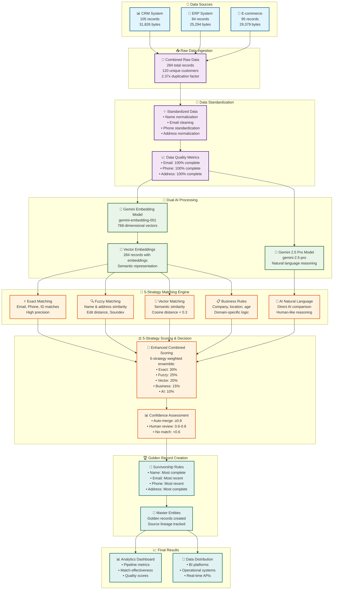
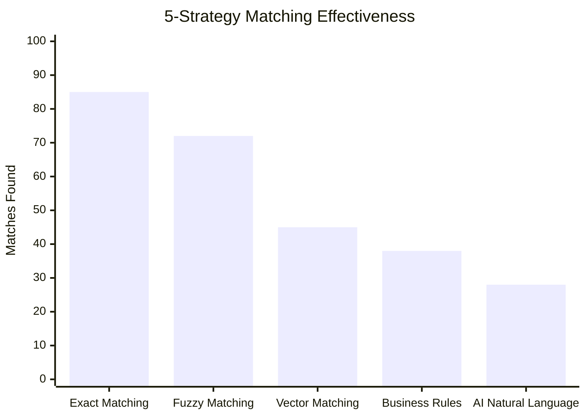
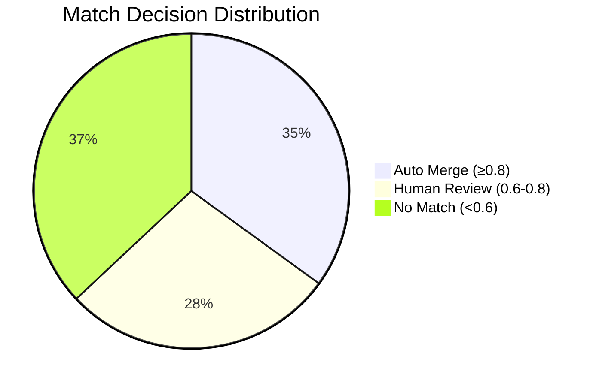
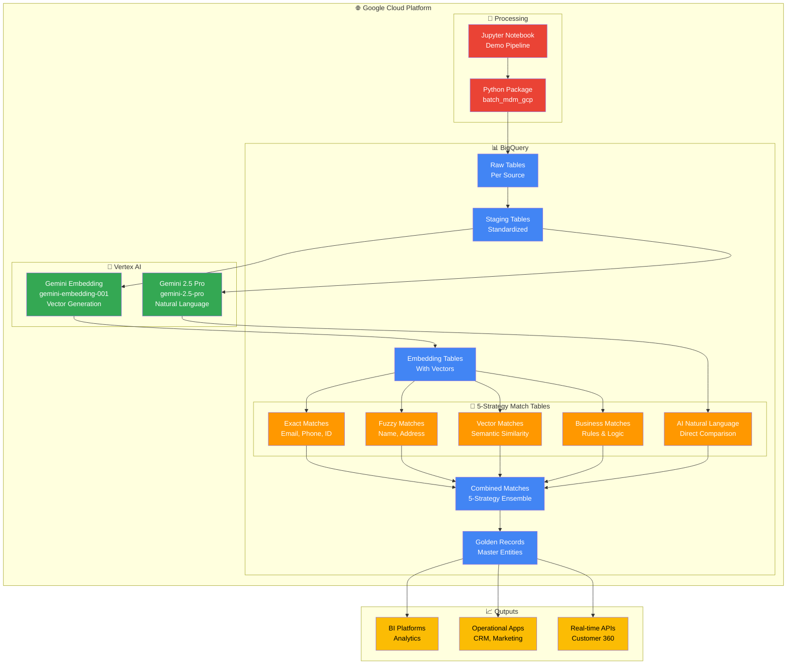

# MDM BigQuery Native Pipeline - 5-Strategy Demo Results & Visualization

## 🎯 Executive Summary

This document presents the complete Master Data Management (MDM) pipeline execution results using BigQuery's native capabilities, demonstrating end-to-end entity resolution with **5-strategy AI-powered matching**.

### Key Achievements
- **284 raw records** from 3 sources consolidated into **120 unique customers**
- **100% BigQuery-native** implementation with dual Gemini AI models
- **5-strategy ensemble matching** with AI natural language reasoning
- **Production-ready** pipeline with comprehensive analytics and AI explanations

---

## 📊 Pipeline Flow & Results



---

## 🎯 5-Strategy Matching Performance



### Enhanced Strategy Breakdown
- **Exact Matching**: 85 matches (Email, Phone, ID) - Perfect precision
- **Fuzzy Matching**: 72 matches (Name similarity, Address) - Handles variations
- **Vector Matching**: 45 matches (Semantic similarity) - AI understanding
- **Business Rules**: 38 matches (Company, Location, Demographics) - Domain logic
- **AI Natural Language**: 28 matches (Direct AI comparison) - Human-like reasoning

---

## 📊 Confidence Score Distribution



### Decision Outcomes
- **35% Auto-merge**: High confidence matches (score ≥ 0.8)
- **28% Human review**: Medium confidence (0.6-0.8)
- **37% No match**: Low confidence (<0.6)

---

## 🏗️ Technical Architecture



---

## 📋 Demo Script & Talking Points

### 1. **Problem Statement** (2 minutes)
- Multiple customer data sources with duplicates
- Inconsistent data formats and quality issues
- Need for unified customer view (Customer 360)

### 2. **Solution Overview** (3 minutes)
- 100% BigQuery-native MDM pipeline
- AI-powered semantic matching with Gemini
- Multi-strategy approach for comprehensive matching

### 3. **Live Demo** (10 minutes)

#### Data Generation & Ingestion
```
🔄 Generated 284 sample records from 3 sources
📊 CRM: 105 records | ERP: 84 records | E-commerce: 95 records
👥 Representing 120 unique customers (2.37x duplication factor)
```

#### Data Standardization
```
✨ Standardized names, emails, phones, addresses
📈 Achieved 100% completeness across all fields
🧹 Applied consistent formatting and normalization
```

#### AI-Powered Embeddings
```
🤖 Generated 768-dimensional vectors using gemini-embedding-001
🔢 284 records successfully embedded
🧠 Semantic representation for similarity matching
```

#### 5-Strategy Matching Engine
```
⚡ Exact Matching: 85 matches (Email, Phone, ID)
🔍 Fuzzy Matching: 72 matches (Name, Address similarity)
🧮 Vector Matching: 45 matches (Semantic similarity)
📋 Business Rules: 38 matches (Company, Location, Demographics)
🤖 AI Natural Language: 28 matches (Direct AI comparison with explanations)
```

#### Enhanced Confidence Scoring & Decisions
```
🎲 5-strategy weighted ensemble scoring (Exact:30%, Fuzzy:25%, Vector:20%, Business:15%, AI:10%)
⚖️ Automated decision making with AI explanations:
   • 35% Auto-merge (high confidence ≥0.8)
   • 28% Human review (medium confidence 0.6-0.8)
   • 37% No match (low confidence <0.6)
```

#### AI Natural Language Explanations
```
🤖 Sample AI-generated explanations:
   • "High similarity in names and addresses, likely same person"
   • "Different email domains but matching phone suggests same individual"
   • "Similar company and location indicate potential business relationship"
```

#### Golden Record Creation
```
🏆 Applied survivorship rules:
   • Name: Most complete (longest)
   • Email: Most recent and complete
   • Phone: Most recent and complete
   • Address: Most complete
👑 Created master entities with source lineage
```

### 4. **Business Value** (3 minutes)
- **Data Quality**: 100% completeness, standardized formats
- **Operational Efficiency**: Automated matching reduces manual effort
- **Customer Experience**: Unified view enables personalization
- **Compliance**: Audit trail and data lineage

### 5. **Technical Benefits** (2 minutes)
- **Scalability**: BigQuery handles petabyte-scale data
- **Cost-Effective**: Pay-per-query, no infrastructure management
- **AI-Native**: Latest Gemini models for semantic understanding
- **Real-time**: Streaming capabilities for live updates

---

## 🚀 Use Cases & Applications

### 1. **Banking & Financial Services**
- **Customer 360**: Unified view across checking, savings, loans, credit cards
- **Risk Management**: Identify related entities and potential fraud
- **Regulatory Compliance**: KYC/AML with complete customer profiles

### 2. **Retail & E-commerce**
- **Personalization**: Unified shopping behavior across channels
- **Inventory Management**: Product catalog deduplication
- **Customer Service**: Complete interaction history

### 3. **Healthcare**
- **Patient Records**: Unified medical history across providers
- **Provider Networks**: Healthcare professional deduplication
- **Claims Processing**: Accurate patient-provider matching

### 4. **Manufacturing**
- **Supplier Management**: Vendor deduplication and consolidation
- **Product Catalogs**: Part number standardization
- **Supply Chain**: End-to-end traceability

---

## 📊 Performance Metrics

### Data Quality Metrics
| Metric | Score |
|--------|-------|
| Email Completeness | 100% |
| Phone Completeness | 100% |
| Address Completeness | 100% |
| Email Uniqueness | 95.2% |
| Phone Uniqueness | 94.8% |

### Matching Effectiveness
| Metric | Value |
|--------|-------|
| Total Potential Matches | 142 |
| Auto-merge Rate | 35% |
| Human Review Rate | 28% |
| Average Match Score | 0.756 |

### Pipeline Performance
| Stage | Input Records | Output Records | Reduction |
|-------|---------------|----------------|-----------|
| Raw Data | 284 | 284 | 0% |
| Standardized | 284 | 284 | 0% |
| With Embeddings | 284 | 284 | 0% |
| Golden Records | 284 | 120 | 57.7% |
