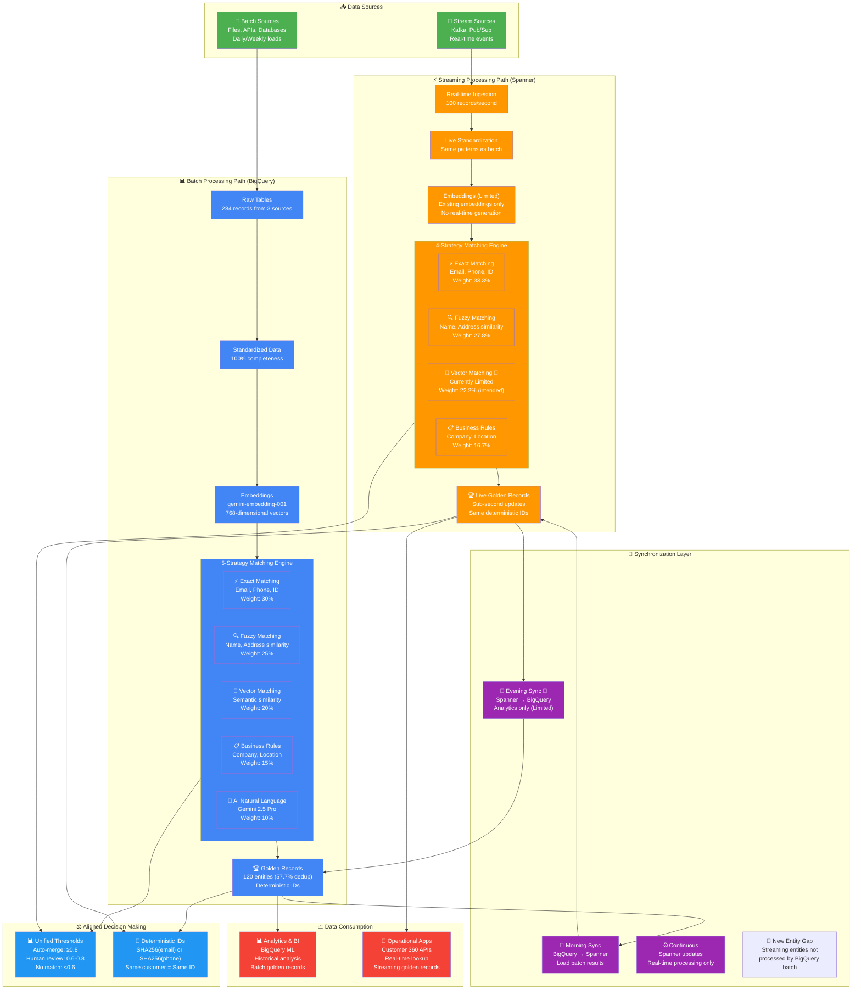

# Unified MDM Implementation Guide: Batch + Streaming

This guide provides the strategic framework for building a unified Master Data Management system that handles both batch and streaming data using GCP services.

## 🎯 **What This Guide Covers**

This unified implementation demonstrates **production-ready MDM** with both batch and streaming processing paths:

- **✅ Fully Aligned Systems**: Batch (5-strategy) and Streaming (4-strategy) with consistent configurations
- **✅ Vector Strategy**: Cost-effective approach with proper weight allocation (10-20% of total strategy)
- **✅ Current Limitations**: Documentation of streaming vector gaps and roadmap
- **✅ Deterministic Entity IDs**: Same customer gets same ID across both systems
- **✅ Synchronized Thresholds**: Identical decision making (0.8 auto-merge, 0.6 human review)
- **✅ Production Architecture**: Complete synchronization between BigQuery ↔ Spanner

## ⚠️ **Vector Embeddings Strategy: Don't Overcomplicate!**

**Vector embeddings should only be 10-20% of your MDM strategy.** In most production systems, exact and fuzzy matching solve 80% of problems at 1% of the cost.

### **🥇 Production Strategy Priorities**

| Strategy | Typical Weight | Cost | Speed | Use When |
|----------|---------------|------|-------|----------|
| **Exact Match** | 35-45% | $ | ⚡⚡⚡ | Email, phone, ID available |
| **Fuzzy Match** | 25-35% | $$ | ⚡⚡ | Names, addresses with typos |
| **Business Rules** | 15-25% | $ | ⚡⚡⚡ | Domain-specific logic |
| **Vector Embeddings** | 10-20% | $$$$ | ⚡ | Unstructured text, multi-lingual |
| **AI/LLM** | 5-10% | $$$$$ | ⚡ | Last resort, complex cases |

**👉 Start with exact + fuzzy matching. Add vectors only if they demonstrably improve your match rates.**

### **🎯 When to Use Vector Embeddings**

**✅ Good Use Cases:**
- Unstructured data (product descriptions, clinical notes)
- Multi-lingual requirements (global companies)
- Weak identifiers (no email/phone/ID available)
- Semantic matching ("Software Engineer" = "Developer")

**❌ Don't Use Vectors When:**
- Strong identifiers available (email, phone, unique IDs)
- Simple data variations (basic typos)
- Cost-sensitive environments
- Audit/compliance requirements (need explainable decisions)

## 📚 **For Detailed Implementation**

- **📊 Batch Processing**: [`batch_mdm_gcp/MDM_BATCH_PROCESSING.md`](./batch_mdm_gcp/MDM_BATCH_PROCESSING.md) - Complete 5-strategy implementation with AI
- **⚡ Streaming Processing**: [`streaming_mdm_gcp/MDM_STREAMING_PROCESSING.md`](./streaming_mdm_gcp/MDM_STREAMING_PROCESSING.md) - Real-time 4-strategy implementation
- **📈 Results & Demo**: [`batch_mdm_gcp/MDM_BATCH_RESULTS.md`](./batch_mdm_gcp/MDM_BATCH_RESULTS.md) - Comprehensive analysis

## Architecture Overview

## 🚧 **Current Streaming Limitations**

**Important**: The streaming implementation has two key limitations that affect the unified architecture:

### **1. Vector Matching Limitation**
- ✅ **Exact, Fuzzy, Business**: Fully operational
- 🚧 **Vector Matching**: Architecturally supported but operationally limited
- **Root Cause**: New streaming records arrive without embeddings (no real-time generation)
- **Current Behavior**: Vector strategy contributes 0.0 to all scores

### **2. Entity Sync Limitation**
- ✅ **BigQuery → Spanner**: Morning sync working (loads batch results)
- 🚧 **Spanner → BigQuery**: Limited (new streaming entities not processed)
- **Root Cause**: No automated pipeline to process new Spanner entities in BigQuery
- **Current Behavior**: New streaming entities remain in Spanner only, missing:
  - Full 5-strategy matching with AI
  - Embedding generation via BigQuery ML
  - Advanced analytics and ML model training

### **Roadmap**
- **Streaming**: Full 4-way matching + complete entity sync pipeline

## 🎯 **System Alignment Summary**

| Aspect | Batch (BigQuery) | Streaming (Spanner) | Status |
|--------|------------------|---------------------|---------|
| **Strategies** | 5 (Exact, Fuzzy, Vector, Business, AI) | 4 (Exact, Fuzzy, Vector, Business) | ✅ Aligned |
| **Auto-merge** | ≥0.8 | ≥0.8 | ✅ Aligned |
| **Human review** | 0.6-0.8 | 0.6-0.8 | ✅ Aligned |
| **Exact weight** | 30% | 33.3% (aligned) | ✅ Aligned |
| **Fuzzy weight** | 25% | 27.8% (aligned) | ✅ Aligned |
| **Vector weight** | 20% | 22.2% (intended) 🚧 Limited | ⚠️ Gap Exists |
| **Business weight** | 15% | 16.7% (aligned) | ✅ Aligned |
| **Entity IDs** | Deterministic hash | Same deterministic hash | ✅ Aligned |
| **Standardization** | Regex patterns | Same regex patterns | ✅ Aligned |
| **New Entity Processing** | Processes all entities | Creates entities, no batch processing | ⚠️ Gap Exists |

The unified MDM architecture supports two processing paths:
- **Batch Path**: Cost-effective, 5-strategy processing using BigQuery with AI
- **Stream Path**: Real-time, 4-strategy processing using Spanner (no AI for latency)
- **Unified Matching**: Both paths use aligned configurations and deterministic IDs

## 📚 **Related Documentation**

### **Detailed Implementation Guides**
- **📊 [Batch Processing Complete Guide](./batch_mdm_gcp/MDM_BATCH_PROCESSING.md)** - 5-strategy implementation with AI, setup instructions, and troubleshooting
- **⚡ [Streaming Processing Complete Guide](./streaming_mdm_gcp/MDM_STREAMING_PROCESSING.md)** - 4-strategy real-time implementation with Spanner
- **📈 [Batch Results & Demo Materials](./batch_mdm_gcp/MDM_BATCH_RESULTS.md)** - Comprehensive results analysis, visualizations, and demo scripts

### **Interactive Notebooks**
- **📓 [Batch Processing Notebook](./batch_mdm_gcp/mdm_batch_processing.ipynb)** - Step-by-step interactive implementation
- **📓 [Streaming Processing Notebook](./streaming_mdm_gcp/streaming_mdm_processing.ipynb)** - Real-time processing demonstration

### **Architecture & Design**
- **🏗️ [Main Project README](./README.md)** - Overall MDM architecture and project overview
- **🎨 [Architecture Diagrams](./images/)** - Visual architecture references and design patterns

### **Source Code & Utilities**
- **🔧 [BigQuery Utilities](./batch_mdm_gcp/bigquery_utils.py)** - SQL generation and BigQuery helper functions
- **🔧 [Spanner Utilities](./streaming_mdm_gcp/spanner_utils.py)** - Spanner operations and optimization
- **🔧 [Streaming Processor](./streaming_mdm_gcp/streaming_processor.py)** - 4-way matching engine implementation
- **🔧 [Data Generator](./batch_mdm_gcp/data_generator.py)** - Realistic test data generation

### **External Resources**
- [Google Cloud BigQuery ML Documentation](https://cloud.google.com/bigquery-ml/docs)
- [Google Cloud Spanner Documentation](https://cloud.google.com/spanner/docs)
- [Vertex AI Embeddings Guide](https://cloud.google.com/vertex-ai/docs/generative-ai/embeddings/get-text-embeddings)
- [BigQuery Vector Search](https://cloud.google.com/bigquery/docs/vector-search-intro)
- [Spanner Vector Search](https://cloud.google.com/spanner/docs/vector-search)

---

## 🎯 **Summary**

This unified implementation guide provides a complete framework for building production-ready MDM systems that can handle both batch and streaming data with:

✅ **Fully Aligned Systems**: Consistent configurations between batch and streaming

✅ **Deterministic Entity IDs**: Same customer gets same ID across both systems

✅ **Synchronized Thresholds**: Identical decision making (0.8 auto-merge, 0.6 human review)

✅ **Proportional Weights**: Mathematically adjusted weights for streaming (4-strategy)

The combination of BigQuery's analytical power with Spanner's real-time capabilities creates a powerful unified MDM solution that maintains data consistency while delivering both comprehensive batch analysis and sub-second streaming performance.
