# Unified MDM Implementation Guide: Batch + Streaming

This guide provides practical implementation examples for building a unified Master Data Management system that handles both batch and streaming data using GCP services.

## 🎯 **What This Guide Covers**

This unified implementation demonstrates **production-ready MDM** with both batch and streaming processing paths:

- **✅ Fully Aligned Systems**: Batch (5-strategy) and Streaming (4-strategy) with consistent configurations
- **✅ Deterministic Entity IDs**: Same customer gets same ID across both systems
- **✅ Synchronized Thresholds**: Identical decision making (0.8 auto-merge, 0.6 human review)
- **✅ Proportional Weights**: Streaming uses mathematically adjusted weights from batch
- **✅ Production Architecture**: Complete synchronization between BigQuery ↔ Spanner

## 📚 **For Detailed Implementation Guides**

- **📊 Batch Processing Details**: See [`batch_mdm_gcp/MDM_BATCH_PROCESSING.md`](./batch_mdm_gcp/MDM_BATCH_PROCESSING.md) - Complete 5-strategy implementation with AI
- **⚡ Streaming Processing Details**: See [`streaming_mdm_gcp/MDM_STREAMING_PROCESSING.md`](./streaming_mdm_gcp/MDM_STREAMING_PROCESSING.md) - Real-time 4-strategy implementation
- **📈 Batch Results & Demo**: See [`batch_mdm_gcp/MDM_BATCH_RESULTS.md`](./batch_mdm_gcp/MDM_BATCH_RESULTS.md) - Comprehensive results analysis

## Architecture Overview

```mermaid
flowchart TB
    subgraph Sources["📥 Data Sources"]
        BATCH_SRC["📁 Batch Sources<br/>Files, APIs, Databases<br/>Daily/Weekly loads"]
        STREAM_SRC["🌊 Stream Sources<br/>Kafka, Pub/Sub<br/>Real-time events"]
    end

    subgraph BatchPath["📊 Batch Processing Path (BigQuery)"]
        BQ_RAW["Raw Tables<br/>284 records from 3 sources"]
        BQ_STANDARD["Standardized Data<br/>100% completeness"]
        BQ_EMBED["Embeddings<br/>gemini-embedding-001<br/>768-dimensional vectors"]

        subgraph BQ_MATCH["5-Strategy Matching Engine"]
            BQ_EXACT["⚡ Exact Matching<br/>Email, Phone, ID<br/>Weight: 30%"]
            BQ_FUZZY["🔍 Fuzzy Matching<br/>Name, Address similarity<br/>Weight: 25%"]
            BQ_VECTOR["🧮 Vector Matching<br/>Semantic similarity<br/>Weight: 20%"]
            BQ_BUSINESS["📋 Business Rules<br/>Company, Location<br/>Weight: 15%"]
            BQ_AI["🤖 AI Natural Language<br/>Gemini 2.5 Pro<br/>Weight: 10%"]
        end

        BQ_GOLDEN["🏆 Golden Records<br/>120 entities (57.7% dedup)<br/>Deterministic IDs"]
    end

    subgraph StreamPath["⚡ Streaming Processing Path (Spanner)"]
        SP_INGEST["Real-time Ingestion<br/>100 records/second"]
        SP_STANDARD["Live Standardization<br/>Same patterns as batch"]
        SP_EMBED["Vector Generation<br/>Same model as batch"]

        subgraph SP_MATCH["4-Strategy Matching Engine"]
            SP_EXACT["⚡ Exact Matching<br/>Email, Phone, ID<br/>Weight: 33% (30/90)"]
            SP_FUZZY["🔍 Fuzzy Matching<br/>Name, Address similarity<br/>Weight: 28% (25/90)"]
            SP_VECTOR["🧮 Vector Matching<br/>Semantic similarity<br/>Weight: 22% (20/90)"]
            SP_BUSINESS["📋 Business Rules<br/>Company, Location<br/>Weight: 17% (15/90)"]
        end

        SP_GOLDEN["🏆 Live Golden Records<br/>Sub-second updates<br/>Same deterministic IDs"]
    end

    subgraph Sync["🔄 Synchronization Layer"]
        MORNING["🌅 Morning Sync<br/>BigQuery → Spanner<br/>Load batch results"]
        CONTINUOUS["⏰ Continuous<br/>Spanner updates<br/>Real-time processing"]
        EVENING["🌆 Evening Sync<br/>Spanner → BigQuery<br/>Analytics feed"]
    end

    subgraph Decision["⚖️ Aligned Decision Making"]
        THRESHOLDS["📊 Unified Thresholds<br/>Auto-merge: ≥0.8<br/>Human review: 0.6-0.8<br/>No match: <0.6"]
        IDS["🔑 Deterministic IDs<br/>SHA256(email) or SHA256(phone)<br/>Same customer = Same ID"]
    end

    subgraph Consumption["📈 Data Consumption"]
        ANALYTICS["📊 Analytics & BI<br/>BigQuery ML<br/>Historical analysis<br/>Batch golden records"]
        OPERATIONAL["🚀 Operational Apps<br/>Customer 360 APIs<br/>Real-time lookup<br/>Streaming golden records"]
    end

    %% Flow connections
    BATCH_SRC --> BQ_RAW
    STREAM_SRC --> SP_INGEST

    BQ_RAW --> BQ_STANDARD
    BQ_STANDARD --> BQ_EMBED
    BQ_EMBED --> BQ_MATCH
    BQ_MATCH --> BQ_GOLDEN

    SP_INGEST --> SP_STANDARD
    SP_STANDARD --> SP_EMBED
    SP_EMBED --> SP_MATCH
    SP_MATCH --> SP_GOLDEN

    BQ_GOLDEN --> MORNING
    MORNING --> SP_GOLDEN
    SP_GOLDEN --> EVENING
    EVENING --> BQ_GOLDEN

    BQ_MATCH --> THRESHOLDS
    SP_MATCH --> THRESHOLDS
    BQ_GOLDEN --> IDS
    SP_GOLDEN --> IDS

    BQ_GOLDEN --> ANALYTICS
    SP_GOLDEN --> OPERATIONAL

    %% Styling
    classDef batchStyle fill:#4285f4,color:#fff
    classDef streamStyle fill:#ff9800,color:#fff
    classDef syncStyle fill:#9c27b0,color:#fff
    classDef sourceStyle fill:#4caf50,color:#fff
    classDef consumeStyle fill:#f44336,color:#fff
    classDef decisionStyle fill:#2196f3,color:#fff

    class BQ_RAW,BQ_STANDARD,BQ_EMBED,BQ_MATCH,BQ_GOLDEN,BQ_EXACT,BQ_FUZZY,BQ_VECTOR,BQ_BUSINESS,BQ_AI batchStyle
    class SP_INGEST,SP_STANDARD,SP_EMBED,SP_MATCH,SP_GOLDEN,SP_EXACT,SP_FUZZY,SP_VECTOR,SP_BUSINESS streamStyle
    class MORNING,CONTINUOUS,EVENING syncStyle
    class BATCH_SRC,STREAM_SRC sourceStyle
    class ANALYTICS,OPERATIONAL consumeStyle
    class THRESHOLDS,IDS decisionStyle
```

## 🎯 **System Alignment Summary**

| Aspect | Batch (BigQuery) | Streaming (Spanner) | Status |
|--------|------------------|---------------------|---------|
| **Strategies** | 5 (Exact, Fuzzy, Vector, Business, AI) | 4 (Exact, Fuzzy, Vector, Business) | ✅ Aligned |
| **Auto-merge** | ≥0.8 | ≥0.8 | ✅ Aligned |
| **Human review** | 0.6-0.8 | 0.6-0.8 | ✅ Aligned |
| **Exact weight** | 30% | 33% (proportional) | ✅ Aligned |
| **Fuzzy weight** | 25% | 28% (proportional) | ✅ Aligned |
| **Vector weight** | 20% | 22% (proportional) | ✅ Aligned |
| **Business weight** | 15% | 17% (proportional) | ✅ Aligned |
| **Entity IDs** | Deterministic hash | Same deterministic hash | ✅ Aligned |
| **Standardization** | Regex patterns | Same regex patterns | ✅ Aligned |

The unified MDM architecture supports two processing paths:
- **Batch Path**: Cost-effective, 5-strategy processing using BigQuery with AI
- **Stream Path**: Real-time, 4-strategy processing using Spanner (no AI for latency)
- **Unified Matching**: Both paths use aligned configurations and deterministic IDs

## 📚 **Related Documentation**

### **Detailed Implementation Guides**
- **📊 [Batch Processing Complete Guide](./batch_mdm_gcp/MDM_BATCH_PROCESSING.md)** - 5-strategy implementation with AI, setup instructions, and troubleshooting
- **⚡ [Streaming Processing Complete Guide](./streaming_mdm_gcp/MDM_STREAMING_PROCESSING.md)** - 4-strategy real-time implementation with Spanner
- **📈 [Batch Results & Demo Materials](./batch_mdm_gcp/MDM_BATCH_RESULTS.md)** - Comprehensive results analysis, visualizations, and demo scripts

### **Interactive Notebooks**
- **📓 [Batch Processing Notebook](./batch_mdm_gcp/mdm_batch_processing.ipynb)** - Step-by-step interactive implementation
- **📓 [Streaming Processing Notebook](./streaming_mdm_gcp/streaming_mdm_processing.ipynb)** - Real-time processing demonstration

### **Architecture & Design**
- **🏗️ [Main Project README](./README.md)** - Overall MDM architecture and project overview
- **🎨 [Architecture Diagrams](./images/)** - Visual architecture references and design patterns

### **Source Code & Utilities**
- **🔧 [BigQuery Utilities](./batch_mdm_gcp/bigquery_utils.py)** - SQL generation and BigQuery helper functions
- **🔧 [Spanner Utilities](./streaming_mdm_gcp/spanner_utils.py)** - Spanner operations and optimization
- **🔧 [Streaming Processor](./streaming_mdm_gcp/streaming_processor.py)** - 4-way matching engine implementation
- **🔧 [Data Generator](./batch_mdm_gcp/data_generator.py)** - Realistic test data generation

### **External Resources**
- [Google Cloud BigQuery ML Documentation](https://cloud.google.com/bigquery-ml/docs)
- [Google Cloud Spanner Documentation](https://cloud.google.com/spanner/docs)
- [Vertex AI Embeddings Guide](https://cloud.google.com/vertex-ai/docs/generative-ai/embeddings/get-text-embeddings)
- [BigQuery Vector Search](https://cloud.google.com/bigquery/docs/vector-search-intro)
- [Spanner Vector Search](https://cloud.google.com/spanner/docs/vector-search)

---

## 🎯 **Summary**

This unified implementation guide provides a complete framework for building production-ready MDM systems that can handle both batch and streaming data with:

✅ **Fully Aligned Systems**: Consistent configurations between batch and streaming
✅ **Deterministic Entity IDs**: Same customer gets same ID across both systems
✅ **Synchronized Thresholds**: Identical decision making (0.8 auto-merge, 0.6 human review)
✅ **Proportional Weights**: Mathematically adjusted weights for streaming (4-strategy)
✅ **Production Synchronization**: Complete BigQuery ↔ Spanner data flow
✅ **Comprehensive Monitoring**: Real-time metrics and alerting
✅ **Migration Guidance**: Step-by-step path from batch to hybrid to streaming
✅ **Cost Optimization**: Strategies for reducing operational costs
✅ **Multi-Region Support**: Global deployment patterns

The combination of BigQuery's analytical power with Spanner's real-time capabilities creates a powerful unified MDM solution that maintains data consistency while delivering both comprehensive batch analysis and sub-second streaming performance.

**Ready for Production MDM! 🚀**
