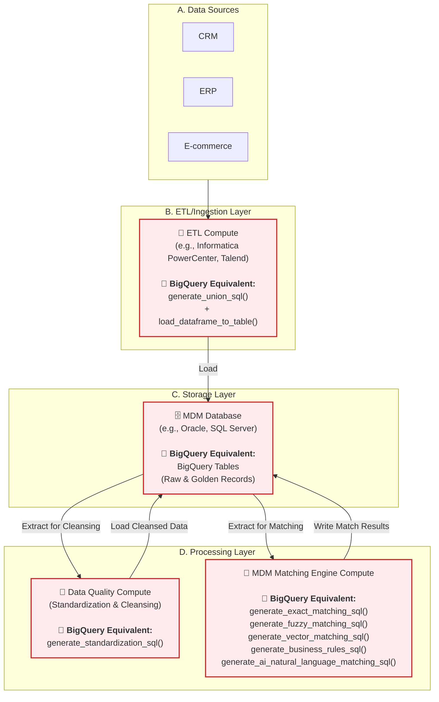
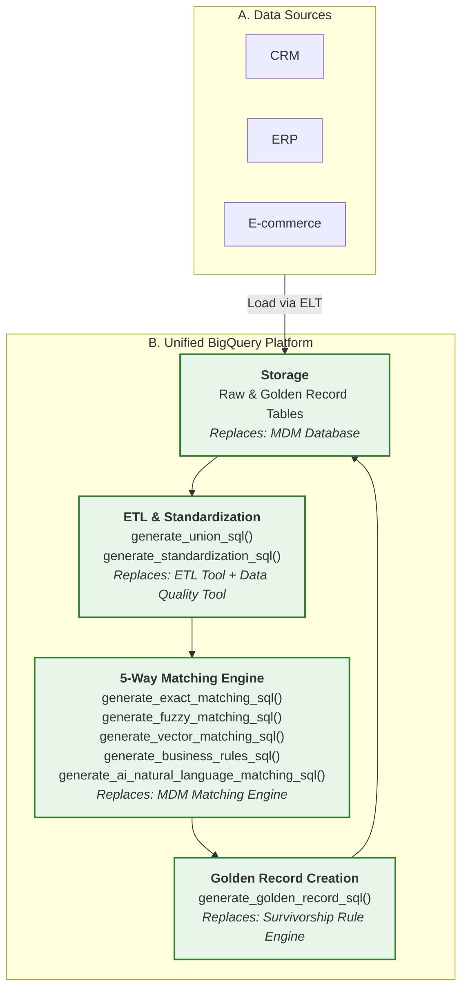
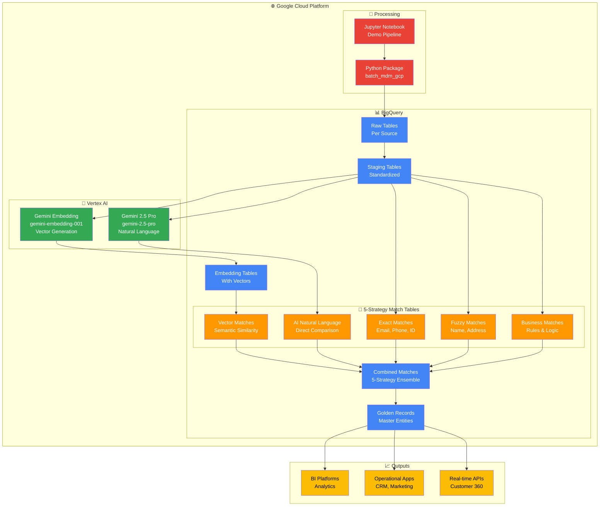
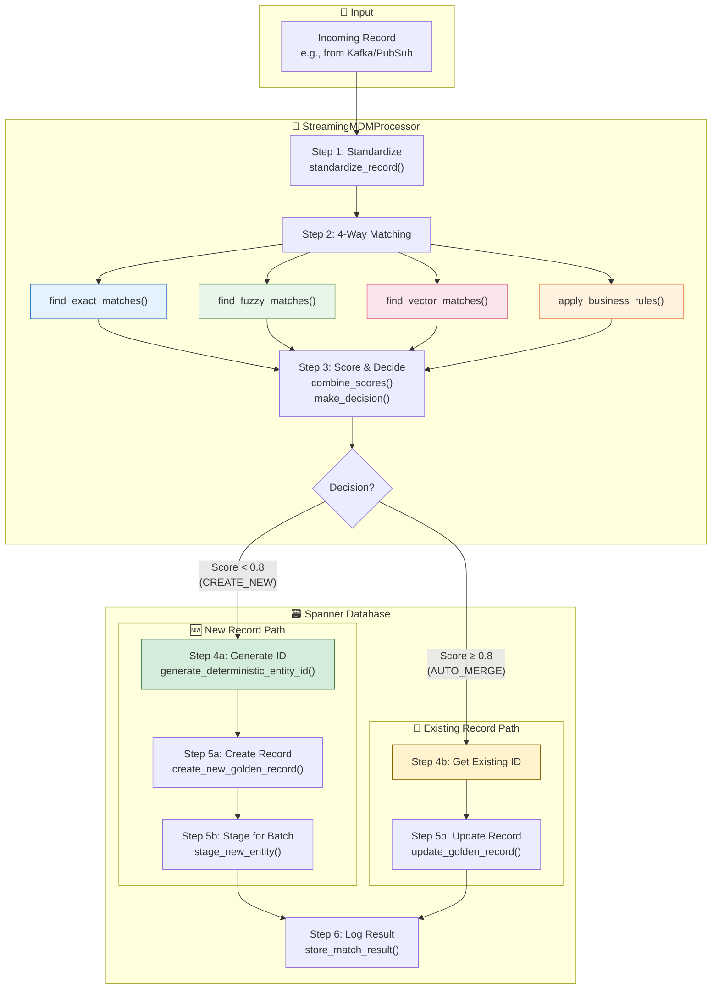
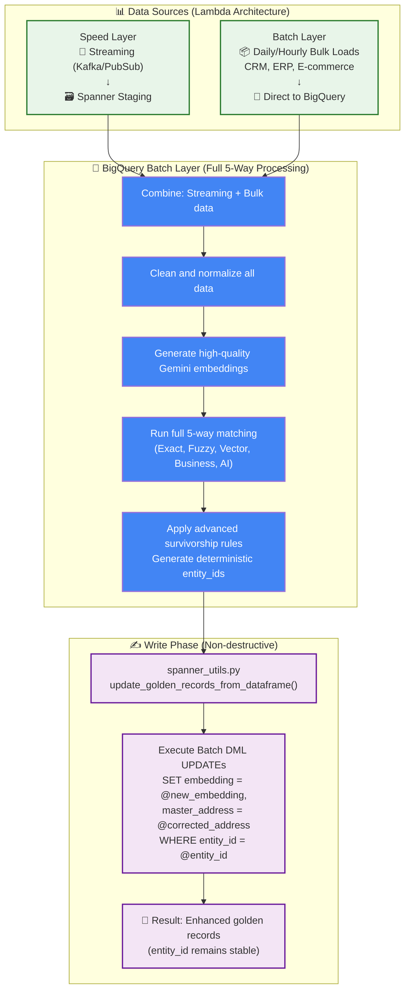

<!-- _class: lead -->
# Modern MDM Architecture on Google Cloud

## Building Enterprise-Grade Master Data Management Solutions

**A comprehensive blueprint for data architects and engineers**

---

## Agenda

- **Why Master Data Management?**
- **Architecture Showdown: Siloed vs. Unified**
- **Deep Dive: The BigQuery 5-Strategy Batch Pipeline**
- **The Real-Time Complement: The Streaming Journey**
- **Bringing It All Together: The Hybrid Lambda Architecture**
- **Summary & Next Steps**

---

<!-- _class: lead -->
# Why Master Data Management?

---

## The Data Fragmentation Challenge

Organizations struggle with:

- 🔄 **Multiple versions** of the same entity across systems
- 📉 **Inconsistent data quality** leading to poor decisions
- ⏰ **Manual reconciliation** efforts that are time-consuming
- ⚠️ **Compliance risks** from inaccurate data

**Result:** Fragmented view of critical business entities

---

## MDM Value Proposition

MDM creates a **single source of truth** enabling:

- 📊 **Improved Decision Making** - Reliable analytics
- ⚡ **Operational Efficiency** - Reduced errors
- 🎯 **Enhanced Customer Experience** - 360-degree view
- ✅ **Regulatory Compliance** - Accurate reporting
- 💰 **Cost Reduction** - Eliminate manual reconciliation

---

<!-- _class: lead -->
# Architecture Showdown: Siloed vs. Unified

---

## Traditional MDM: Complex & Siloed

**❌ Problems:** Data movement overhead, multiple licenses, complex infrastructure

**📖 [Detailed Comparison: BigQuery vs. Traditional MDM](./batch_mdm_gcp/MDM_BATCH_COMPARISON.md)**

---

## BigQuery-Native: Unified & Simple

**✅ Benefits:** Single platform, no data movement, simple Python functions

---

<!-- _class: lead -->
# Deep Dive: The BigQuery 5-Strategy Batch Pipeline

---

## Technical Architecture

**Technical Components:** 5-strategy matching with dual Gemini AI models

**📖 [Demo Results & Performance Metrics](./batch_mdm_gcp/MDM_BATCH_RESULTS.md)**

---

<!-- _class: lead -->
# The Real-Time Complement: The Streaming Journey

---

## 4-Strategy Real-Time Processing

**Target:** Sub-400ms processing time for real-time operations

**📖 [Detailed Guide: The Streaming Journey](./streaming_mdm_gcp/MDM_STREAMING_JOURNEY.md)**

---

<!-- _class: lead -->
# Bringing It All Together: The Hybrid Lambda Architecture

---

## Lambda Architecture: Speed + Accuracy

**Best of Both Worlds:** Real-time speed + batch accuracy

**📖 [Implementation Guide: Lambda Architecture Pattern B](./streaming_mdm_gcp/MDM_STREAMING_JOURNEY.md#part-4-implementing-the-batch-sync-pattern-b)**

---

## Key Benefits

### **Speed Layer (Spanner)**
- ⚡ Sub-400ms latency for real-time operations
- 🎯 Immediate availability for operational systems
- 📊 "Good enough" accuracy for live applications

### **Batch Layer (BigQuery)**
- 🧠 Comprehensive 5-way matching with AI
- 🎨 High-quality Gemini embeddings
- 📋 Advanced survivorship rules
- 📈 Processing of both streaming and bulk source data

### **Unified Benefits**
- 🔑 Deterministic IDs prevent duplicates
- 🔄 Non-destructive updates maintain stability
- 📊 Audit trail via processing_path field

---

<!-- _class: lead -->
# Summary & Next Steps

---

## Key Takeaways

✅ **Traditional MDM** is complex and expensive (multiple systems, data movement)
✅ **BigQuery-native** approach is unified and cost-effective (single platform, Python functions)
✅ **5-strategy matching** enables comprehensive entity resolution with AI
✅ **Streaming complement** provides real-time capabilities with sub-400ms latency
✅ **Lambda architecture** combines speed and accuracy in production

---

## Getting Started

1. **Start with Batch** - Implement BigQuery 5-strategy pipeline first
2. **Add Streaming** - Layer on Spanner for real-time requirements
3. **Implement Sync** - Set up Lambda architecture for best of both worlds
4. **Monitor & Tune** - Use comprehensive metrics for optimization

---

## Resources

- **📁 GitHub Repository:** Complete implementation with notebooks
- **📊 Interactive Demos:** Step-by-step Jupyter notebooks
- **🏗️ Architecture Guides:** Detailed technical documentation
- **🔧 Production Utils:** Ready-to-use Python utilities

---

<!-- _class: lead -->
# Questions & Discussion

**Thank you!**

*Modern MDM Architecture on Google Cloud*
