# MDM Pipeline Architecture - Presentation Diagrams

## Slide 1: High-Level MDM Pipeline Architecture

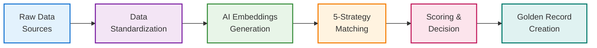

### Technical Details
- **Function:** Pipeline overview combining multiple functions
- **Purpose:** Complete end-to-end Master Data Management pipeline using BigQuery native capabilities
- **Key Components:**
  - **Raw Data Sources:** Multiple input systems (CRM, ERP, E-commerce)
  - **Data Standardization:** Clean and normalize customer data
  - **AI Embeddings Generation:** Create vector representations using Gemini
  - **5-Strategy Matching:** Multi-approach entity resolution
  - **Scoring & Decision:** Weighted ensemble scoring with automated decisions
  - **Golden Record Creation:** Master entity generation with survivorship rules

---

## Slide 2a: 5-Strategy Matching Engine Overview

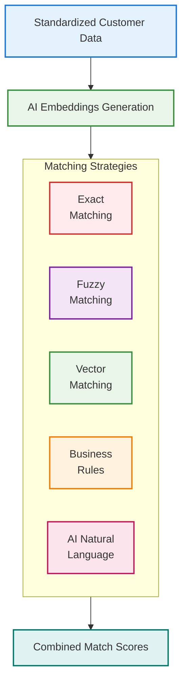

### Technical Details
- **Function:** `generate_embedding_sql` + 5 matching strategies
- **Purpose:** Comprehensive matching engine using multiple approaches for maximum accuracy
- **Key Components:**
  - **AI Embeddings Generation:** Uses `gemini-embedding-001` model to create 768-dimensional vectors from concatenated customer data (name, email, address, company)
  - **Exact Matching:** High-precision matching on email, phone, and customer ID
  - **Fuzzy Matching:** Handles name/address variations using edit distance, soundex, and token matching
  - **Vector Matching:** Semantic similarity using cosine distance on embeddings
  - **Business Rules:** Domain-specific logic for company, location, age, and income compatibility
  - **AI Natural Language:** Direct comparison using Gemini 2.5 Pro with confidence scoring
- **Implementation:** Each strategy runs in parallel, then results are combined using weighted ensemble scoring

---

## Slide 2b: AI Model Setup & Embedding Generation

```mermaid
flowchart LR
    Input[Standardized Customer Data] --> AIEmbeddings

    subgraph AIEmbeddings["AI Embeddings Generation"]
        direction LR

        subgraph Setup["AI Model Setup"]
            direction TB
            A[Create Embedding Model<br/>gemini-embedding-001]
            B[Create AI Model<br/>gemini-2.5-pro]
        end

        Setup --> Prepare

        subgraph Prepare["Content Preparation"]
            direction TB
            C[Concatenate Fields<br/>Name + Email + Address]
            D[Handle NULL Values<br/>IFNULL Processing]
        end

        Prepare --> Generate

        subgraph Generate["Embedding Generation"]
            direction TB
            E[ML.GENERATE_EMBEDDING<br/>768-dimensional vectors]
            F[Task Type<br/>RETRIEVAL_DOCUMENT]
        end
    end

    AIEmbeddings --> Output[Vector Embeddings<br/>Ready for Matching]

    style Input fill:#e3f2fd,stroke:#1976d2,stroke-width:2px
    style Output fill:#e0f2f1,stroke:#00796b,stroke-width:2px
    style AIEmbeddings fill:#e8f5e8,stroke:#388e3c,stroke-width:3px
    style A fill:#e8f5e8,stroke:#388e3c,stroke-width:2px
    style B fill:#e8f5e8,stroke:#388e3c,stroke-width:2px
    style C fill:#f3e5f5,stroke:#7b1fa2,stroke-width:2px
    style D fill:#f3e5f5,stroke:#7b1fa2,stroke-width:2px
    style E fill:#fff3e0,stroke:#f57c00,stroke-width:2px
    style F fill:#fff3e0,stroke:#f57c00,stroke-width:2px
```

### Technical Details
- **Function:** `generate_embedding_sql` + BigQuery ML model creation
- **Purpose:** Set up AI models and create semantic vector representations for similarity matching
- **Key Components:**
  - **Create Embedding Model:** Uses `CREATE MODEL` with `REMOTE WITH CONNECTION DEFAULT` and `ENDPOINT = 'gemini-embedding-001'` for vector generation
  - **Create AI Model:** Sets up `gemini-2.5-pro` model for later natural language matching with `ENDPOINT = 'gemini-2.5-pro'`
  - **Concatenate Fields:** Combines `full_name_clean`, `email_clean`, `address_clean`, `city_clean`, and `company` into single content string
  - **Handle NULL Values:** Uses `IFNULL` to replace missing values with empty strings for clean concatenation
  - **ML.GENERATE_EMBEDDING:** Calls BigQuery ML function with embedding model to create 768-dimensional vectors
  - **Task Type Configuration:** Uses `STRUCT` with `flatten_json_output: TRUE` and `task_type: 'RETRIEVAL_DOCUMENT'` for optimal embedding generation
- **Implementation:** BigQuery ML integration with Vertex AI endpoints. Content aggregation ensures comprehensive semantic representation of each customer record for downstream vector similarity matching

---

## Slide 3: Data Sources to Golden Records Flow

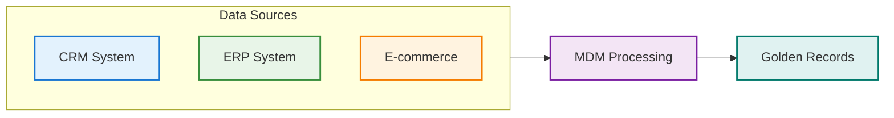

### Technical Details
- **Function:** `generate_union_sql` for data consolidation
- **Purpose:** Consolidate multiple data sources into unified golden records through the complete MDM pipeline
- **Key Components:**
  - **CRM System:** Customer relationship management data with sales and interaction history
  - **ERP System:** Enterprise resource planning data with financial and operational customer information
  - **E-commerce:** Online transaction and behavioral data
  - **MDM Processing:** Complete pipeline processing including standardization, matching, and golden record creation
  - **Golden Records:** Final master entities representing unique customers across all systems
- **Implementation:** Union of all source data, followed by complete MDM pipeline processing to produce unified customer master data

---

## Slide 4: Data Standardization Pipeline

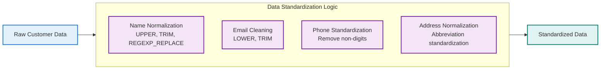

### Technical Details
- **Function:** `generate_standardization_sql`
- **Purpose:** Clean and standardize raw customer data to ensure consistent formatting for accurate matching
- **Key Components:**
  - **Name Normalization:** Converts names to uppercase and removes special characters using `TRIM`, `UPPER`, and `REGEXP_REPLACE`
  - **Email Cleaning:** Converts emails to lowercase and trims whitespace using `LOWER` and `TRIM`
  - **Phone Standardization:** Removes all non-numeric characters using `REGEXP_REPLACE` for consistent phone number format
  - **Address Normalization:** Standardizes common address abbreviations (e.g., 'STREET' to 'ST') and converts to uppercase using nested `REGEXP_REPLACE` calls
- **Implementation:** SQL transformations applied to raw data to create standardized versions of all key customer fields for downstream matching

---

## Slide 5: Exact Matching Strategy

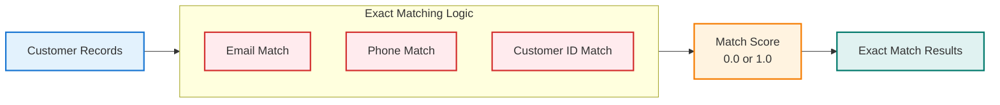

### Technical Details
- **Function:** `generate_exact_matching_sql`
- **Purpose:** Performs high-precision matching on key identifiers for definitive customer matches
- **Key Components:**
  - **Email Match:** Uses `CASE` statement to assign score of `1.0` for exact matches on `email_clean` field
  - **Phone Match:** Uses `CASE` statement to assign score of `1.0` for exact matches on `phone_clean` field
  - **Customer ID Match:** Uses `CASE` statement to assign score of `1.0` for exact matches on `customer_id` field
  - **Match Score:** Binary scoring (0.0 or 1.0) providing definitive match/no-match decisions
- **Implementation:** Creates all possible record pairs using `CROSS JOIN` optimized with `a.record_id < b.record_id` to avoid duplicates. Final `exact_overall_score` uses `GREATEST` function to select highest score from email, phone, and ID checks

---

## Slide 6: Fuzzy Matching Strategy

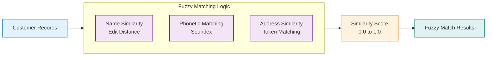

### Technical Details
- **Function:** `generate_fuzzy_matching_sql`
- **Purpose:** Handles variations in names and addresses that exact matching would miss
- **Key Components:**
  - **Name Similarity:** Uses `EDIT_DISTANCE` (Levenshtein) to calculate normalized similarity score based on character-level distance between strings
  - **Phonetic Matching:** Uses `SOUNDEX` algorithm that assigns score of `0.8` if phonetic codes of names match, handling pronunciation variations
  - **Address Similarity:** Uses `EDIT_DISTANCE` on address fields to handle abbreviations and formatting differences
  - **Token Matching:** Splits names into words and calculates similarity based on proportion of shared tokens
- **Implementation:** Final `name_fuzzy_score` uses `GREATEST` function to select best score from edit distance, soundex, and token matching. `fuzzy_overall_score` averages name and address scores

---

## Slide 7: AI-Powered Matching Strategies

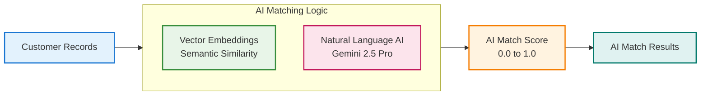

### Technical Details
- **Functions:** `generate_vector_matching_sql` + `generate_ai_natural_language_matching_sql`
- **Purpose:** Uses advanced AI techniques for semantic understanding and human-like comparison of customer records
- **Key Components:**
  - **Vector Embeddings:** Uses `COSINE_DISTANCE` to calculate similarity between 768-dimensional vector embeddings. Filters for pairs with distance `< 0.3` to focus on highly similar records. Converts distance to similarity score using `1 - COSINE_DISTANCE`
  - **Natural Language AI:** Uses Gemini 2.5 Pro with `AI.GENERATE_TABLE` to create detailed prompts for each record pair. Specifies `output_schema` for `similarity_score`, `confidence`, and `explanation`. Creates small batches (LIMIT 500) for cost control
- **Implementation:** Vector matching finds semantically similar records using embeddings. AI natural language provides human-like reasoning with confidence scoring and explanations. Results filtered for confidence > 0.6

---

## Slide 8: Business Rules Strategy

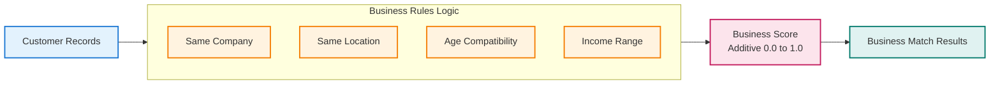

### Technical Details
- **Function:** `generate_business_rules_sql`
- **Purpose:** Applies domain-specific logic to identify matches based on business context and relationships
- **Key Components:**
  - **Same Company:** Assigns partial score of `0.3` for matches on `company` field when both records have company information
  - **Same Location:** Assigns score of `0.2` for matches on `city_clean` and `state_clean` when location data is available
  - **Age Compatibility:** Uses `DATE_DIFF` to assign scores based on age proximity - `0.4` for within 1 year, `0.2` for within 5 years of date_of_birth
  - **Income Range:** Assigns score of `0.1` when annual income values are within 20% of each other using ratio calculation
- **Implementation:** Unlike other strategies, these scores are additive, meaning pairs matching on multiple business rules get higher combined scores. Uses `CASE` statements for conditional scoring based on data availability

---

## Slide 9: Match Scoring & Decision Process

```mermaid
flowchart LR
    Strategies[5 Strategy Results] --> Combine

    subgraph Combine["Weighted Scoring"]
        direction TB
        A[Exact: 30%]
        B[Fuzzy: 25%]
        C[Vector: 20%]
        D[Business: 15%]
        E[AI: 10%]
    end

    Combine --> Decision

    subgraph Decision["Decision Logic"]
        direction TB
        F[Score ≥ 0.8<br/>Auto Merge]
        G[Score 0.6-0.8<br/>Human Review]
        H[Score < 0.6<br/>No Match]
    end

    style Strategies fill:#e3f2fd,stroke:#1976d2,stroke-width:2px
    style A fill:#ffebee,stroke:#d32f2f,stroke-width:2px
    style B fill:#f3e5f5,stroke:#7b1fa2,stroke-width:2px
    style C fill:#e8f5e8,stroke:#388e3c,stroke-width:2px
    style D fill:#fff3e0,stroke:#f57c00,stroke-width:2px
    style E fill:#fce4ec,stroke:#c2185b,stroke-width:2px
    style F fill:#e0f2f1,stroke:#00796b,stroke-width:2px
    style G fill:#fff9c4,stroke:#f9a825,stroke-width:2px
    style H fill:#ffebee,stroke:#e53935,stroke-width:2px
```

### Technical Details
- **Function:** `generate_combined_scoring_sql`
- **Purpose:** Creates final weighted ensemble score from all five strategies and makes automated match decisions
- **Key Components:**
  - **Weighted Scoring:** Combines strategy scores using weighted average - Exact (30%), Fuzzy (25%), Vector (20%), Business (15%), AI (10%)
  - **Score Aggregation:** Uses `LEFT JOIN` to retrieve scores from each strategy table, `COALESCE(..., 0.0)` ensures missing scores default to 0
  - **Decision Logic:** Assigns `match_decision` based on thresholds - `auto_merge` for ≥0.8, `human_review` for 0.6-0.8, `no_match` for <0.6
  - **Confidence Assessment:** Provides confidence levels (high, medium, low) corresponding to score ranges
- **Implementation:** `all_pairs` CTE gathers unique record pairs from any strategy. `combined_scores` CTE calculates weighted ensemble. Final SELECT applies decision thresholds and confidence scoring

---

## Slide 10: Golden Record Creation Process

```mermaid
flowchart LR
    Input[High-Confidence<br/>Match Pairs] --> Cluster

    subgraph Cluster["Clustering Logic"]
        direction TB
        A[Build Connection Graph]
        B[Find Connected Groups]
        C[Assign Cluster IDs]
    end

    Cluster --> Survive

    subgraph Survive["Survivorship Rules"]
        direction TB
        D[Best Name<br/>Most Complete]
        E[Best Email<br/>Most Recent]
        F[Best Address<br/>Most Complete]
    end

    Survive --> Output[Master Golden Records]

    style Input fill:#e3f2fd,stroke:#1976d2,stroke-width:2px
    style Output fill:#e0f2f1,stroke:#00796b,stroke-width:2px
    style A fill:#f3e5f5,stroke:#7b1fa2,stroke-width:2px
    style B fill:#f3e5f5,stroke:#7b1fa2,stroke-width:2px
    style C fill:#f3e5f5,stroke:#7b1fa2,stroke-width:2px
    style D fill:#fff3e0,stroke:#f57c00,stroke-width:2px
    style E fill:#fff3e0,stroke:#f57c00,stroke-width:2px
    style F fill:#fff3e0,stroke:#f57c00,stroke-width:2px
```

### Technical Details
- **Function:** `generate_golden_record_sql`
- **Purpose:** Final multi-step process that clusters matching records and applies survivorship rules to create single "golden" record for each unique entity
- **Key Components:**
  - **Build Connection Graph:** Treats each high-confidence pair as connection in graph, creating bidirectional links using `edges` CTE for graph traversal
  - **Find Connected Groups:** Implements transitive closure to find all records connected to each other, even indirectly (if A matches B, and B matches C, then A, B, C belong to same cluster)
  - **Assign Cluster IDs:** Uses smallest `record_id` in component as `cluster_id` through iterative propagation across connected components
  - **Survivorship Rules:** Uses `ARRAY_AGG` with `ORDER BY` and `LIMIT 1` to select "best" attribute values - most complete name, most recent email, most complete address
- **Implementation:** Multi-CTE process with `match_pairs`, `edges`, clustering CTEs (`initial_clusters`, `propagated_clusters`, `final_clusters`), and `golden_records_raw` for survivorship. Final step generates deterministic `master_id` using hash of best identifier
