# Streaming MDM with Spanner: Implementation Guide

## Overview

This document details the implementation of a streaming Master Data Management (MDM) system using Google Cloud Spanner. It is designed for real-time entity resolution and is optimized for low-latency, high-throughput environments.

This system complements the [BigQuery-based batch processing pipeline](../batch_mdm_gcp/MDM_BATCH_PROCESSING.md), which prioritizes maximum accuracy over speed.

---

## Part 1: The Core Trade-Off: Speed vs. Accuracy

A fundamental design principle separates the streaming and batch MDM systems:

| System | Primary Goal | Approach |
| :--- | :--- | :--- |
| **Batch (BigQuery)** | **Maximum Accuracy** | Uses a comprehensive, multi-algorithm "shotgun" approach (`EDIT_DISTANCE`, `SOUNDEX`, token matching) on the entire dataset. It can afford to be computationally "expensive" as it runs offline. |
| **Streaming (Spanner)** | **Maximum Speed** | Uses a simplified, single-algorithm "rifle" approach optimized for sub-second latency. It prioritizes performance to handle real-time data feeds. |

This trade-off is most evident in the fuzzy matching logic.

### Fuzzy Matching: A Tale of Two Implementations

**1. The Batch (BigQuery) Method: Thoroughness**
- **What it does:** Uses a combination of `EDIT_DISTANCE`, `SOUNDEX`, and token-based matching for names.
- **Why:** To catch every possible type of name variation, whether it's a typo (edit distance), a phonetic difference (Soundex), or a structural change (token matching).
- **Result:** High accuracy, but at a computational cost that is only suitable for offline batch processing.

**2. The Streaming (Spanner) Method: Performance**
- **What it does:** Uses a two-step process:
    1.  **Candidate Selection:** Fetches a small set of potential matches from Spanner using a fast, indexed prefix search (`WHERE STARTS_WITH(...) LIMIT 20`).
    2.  **Similarity Calculation:** Runs a single `EDIT_DISTANCE` calculation in Python on only that small set of candidates.
- **Why:** This approach is a deliberate compromise. It avoids a full table scan and computationally expensive operations inside the database. By performing the intensive calculation on a tiny, pre-filtered dataset in the application layer, it achieves the required low latency.
- **Result:** Very high speed, with good accuracy for the most common data issue (typos), while intentionally sacrificing the comprehensiveness of the batch method.

This difference is not an oversight; it is a necessary architectural decision to meet the distinct requirements of a real-time system.

---

## Part 2: Hybrid Synchronization Patterns

The most complex challenge in a hybrid (streaming + batch) MDM system is keeping the two data stores consistent. There are two primary patterns for this.

### Pattern A: BigQuery as the Ultimate Source of Truth

- **How it works:** The BigQuery batch job runs periodically (e.g., daily), creating the "perfect" set of golden records. This result is then used to **completely overwrite** the golden records table in Spanner.
- **Pros:** Guarantees the highest possible data accuracy in Spanner over the long term.
- **Cons:** Highly disruptive. An entity created or merged in Spanner at 10:00 AM could be altered or disappear when the batch job runs, causing "flickering" `entity_id`s that break operational applications.

### Pattern B: Spanner as the Operational Source of Truth (Recommended)

This is the pattern this repository is designed for.

- **How it works:**
    1.  **Spanner is the primary source for operational systems.** The `golden_entities` table in Spanner is considered the live, authoritative view. Its `entity_id`s are stable.
    2.  The BigQuery batch job acts as a powerful **enhancement and correction service**, not an overwriter.
    3.  The batch job runs its more accurate 5-way matching. Instead of replacing data, it generates a set of **non-destructive `UPDATE` statements** to be applied to Spanner.
    4.  These updates can enrich records (e.g., adding a high-quality embedding) or correct them based on superior survivorship logic (e.g., updating the `master_name` or `master_address`).
- **Pros:**
    - **Operationally Stable:** `entity_id`s never flicker, which is critical for dependent applications.
    - **Best of Both Worlds:** You get Spanner's real-time speed and stability, enhanced by BigQuery's offline analytical power.
- **Cons:** Requires careful design to handle potential conflicts. The real-time matching must be "good enough" to prevent incorrect merges that are difficult to undo automatically.

The evidence in this repository—such as deterministic ID generation and staging tables—points to **Pattern B as the intended and recommended architecture.**

---

## Part 3: The Journey of a Streaming Record & Consistency with Batch

This section provides a complete walkthrough of how a single record flows through the streaming processor, highlighting how each step maintains consistency with the batch pipeline. This serves both as documentation and as validation that every function in the codebase serves a purpose.

### Processing Flow Diagram


### Step-by-Step Breakdown with Batch Consistency

#### **Step 1: Standardization (`standardize_record`)**

**Streaming Flow:**
```python
def standardize_record(self, record: Dict[str, Any]) -> Dict[str, Any]:
    # Name: Remove non-alpha, strip, uppercase
    standardized['full_name_clean'] = re.sub(r'[^a-zA-Z\s]', '', record['full_name']).strip().upper()
    # Email: Lowercase, strip
    standardized['email_clean'] = record['email'].lower().strip()
    # Phone: Digits only
    standardized['phone_clean'] = re.sub(r'[^0-9]', '', record['phone'])
    # Address: Uppercase, replace abbreviations
    addr = record['address'].upper().strip()
    addr = re.sub(r'\bSTREET\b', 'ST', addr)  # And other replacements...
```

**Consistency with Batch:** This step is **100% identical** to the logic in `generate_standardization_sql()`:
```sql
-- BigQuery equivalent
TRIM(UPPER(REGEXP_REPLACE(full_name, r'[^a-zA-Z\\s]', ''))) AS full_name_clean,
LOWER(TRIM(email)) AS email_clean,
REGEXP_REPLACE(phone, r'[^0-9]', '') AS phone_clean,
TRIM(UPPER(REGEXP_REPLACE(...))) AS address_clean
```

**Why Critical:** This ensures that the data entering both matching pipelines is exactly the same, providing the foundation for all subsequent consistency.

---

#### **Step 2: 4-Way Matching**

**Streaming Flow:** Four independent matching strategies run in parallel:

##### **2a. Exact Matching (`find_exact_matches`)**
```python
def find_exact_matches(self, record: Dict[str, Any]) -> List[Tuple[str, float, str]]:
    # Email exact match
    query = "SELECT entity_id FROM golden_entities WHERE master_email = @email"
    # Phone exact match
    query = "SELECT entity_id FROM golden_entities WHERE master_phone = @phone"
```

**Consistency with Batch:** Identical logic to `generate_exact_matching_sql()`:
```sql
-- BigQuery equivalent
CASE WHEN a.email_clean = b.email_clean AND a.email_clean IS NOT NULL THEN 1.0 ELSE 0.0 END
```

##### **2b. Fuzzy Matching (`find_fuzzy_matches`)**
```python
def find_fuzzy_matches(self, record: Dict[str, Any]) -> List[Tuple[str, float, str]]:
    # Step 1: Get candidates with prefix search (performance optimization)
    query = "SELECT entity_id, master_name FROM golden_entities WHERE STARTS_WITH(master_name, @prefix) LIMIT 20"
    # Step 2: Calculate edit distance in Python
    similarity = self.calculate_string_similarity(record['full_name_clean'], master_name)
```

**Consistency with Batch:** The **core algorithm is identical** - both use `EDIT_DISTANCE`. The streaming version uses the performance-optimized two-step approach:
```sql
-- BigQuery equivalent (applied to all pairs)
1.0 - (EDIT_DISTANCE(a.full_name_clean, b.full_name_clean) / GREATEST(LENGTH(a.full_name_clean), LENGTH(b.full_name_clean)))
```

**Performance Trade-off:** Batch processes all pairs (`CROSS JOIN`), streaming processes only 20 candidates. This sacrifices some recall for speed, but catches the most common issues (typos).

##### **2c. Vector Matching (`find_vector_matches`)**
```python
def find_vector_matches(self, record: Dict[str, Any], embedding: List[float]) -> List[Tuple[str, float, str]]:
    # Currently limited: uses existing embeddings only, no real-time generation
    similar_entities = self.spanner_helper.query_similar_embeddings(query_embedding=embedding, limit=10)
```

**Consistency with Batch:** This is an area of **intentional, temporary inconsistency**:
- **Batch:** Generates embeddings for all records using `ML.GENERATE_EMBEDDING` and performs full vector search
- **Streaming:** Uses existing embeddings only (no real-time generation for performance)

**Roadmap:** Full consistency requires Vertex AI integration for real-time embedding generation (+200-500ms latency cost).

##### **2d. Business Rules (`apply_business_rules`)**
```python
def apply_business_rules(self, record: Dict[str, Any]) -> List[Tuple[str, float, str]]:
    # Same company rule
    query = "SELECT entity_id FROM golden_entities WHERE master_company = @company"
    # Same location rule
    query = "SELECT entity_id FROM golden_entities WHERE master_city = @city AND master_state = @state"
```

**Consistency with Batch:** The logic is identical to `generate_business_rules_sql()`:
```sql
-- BigQuery equivalent
CASE WHEN a.company = b.company AND a.company IS NOT NULL THEN 0.3 ELSE 0.0 END
```

---

#### **Step 3: Scoring & Decision (`combine_scores`, `make_decision`)**

**Streaming Flow:**
```python
def combine_scores(self, exact_matches, fuzzy_matches, vector_matches, business_matches):
    # Weighted combination using 4-way weights
    combined_score = (
        self.weights['exact'] * scores['exact'] +      # 33%
        self.weights['fuzzy'] * scores['fuzzy'] +      # 28%
        self.weights['vector'] * scores['vector'] +    # 22%
        self.weights['business'] * scores['business']  # 17%
    )

def make_decision(self, combined_score: float):
    if combined_score >= 0.8: return 'AUTO_MERGE'
    elif combined_score >= 0.6: return 'HUMAN_REVIEW'
    else: return 'CREATE_NEW'
```

**Consistency with Batch:** The weights and thresholds are explicitly aligned with `generate_combined_scoring_sql()`. The batch system uses 5 strategies (including AI), so weights are adjusted but decision logic is the same.

---

#### **Step 4: Deterministic ID Generation (`generate_deterministic_entity_id`)**

**Streaming Flow:**
```python
def generate_deterministic_entity_id(self, record: Dict[str, Any], matched_entity_id: Optional[str] = None):
    if matched_entity_id: return matched_entity_id  # Use existing ID for merges

    if record.get('email_clean'):
        hash_input = f"email:{record['email_clean']}"
        return hashlib.sha256(hash_input.encode()).hexdigest()[:36]
    elif record.get('phone_clean'):
        hash_input = f"phone:{record['phone_clean']}"
        return hashlib.sha256(hash_input.encode()).hexdigest()[:36]
    else:
        return str(uuid.uuid4())  # Fallback for records without identifiers
```

**Consistency with Batch:** This is **critically identical** to `generate_golden_record_sql()`:
```sql
-- BigQuery equivalent
CASE
  WHEN master_email IS NOT NULL THEN SUBSTR(TO_HEX(SHA256(CONCAT('email:', master_email))), 1, 36)
  WHEN master_phone IS NOT NULL THEN SUBSTR(TO_HEX(SHA256(CONCAT('phone:', master_phone))), 1, 36)
  ELSE cluster_id
END as master_id
```

**Why Critical:** This guarantees that if both systems independently create the same entity, it gets the **exact same `entity_id`**. This is the key that enables non-destructive synchronization.

---

#### **Step 5a: Golden Record Creation (`create_new_golden_record`)**

**Streaming Flow:**
```python
def create_new_golden_record(self, record: Dict[str, Any], embedding: List[float]) -> str:
    entity_id = self.generate_deterministic_entity_id(record)
    # UPSERT logic: check if exists, update if found, insert if new
    # Stage for batch processing
    self.spanner_helper.stage_new_entity(entity_id, golden_record_data, source_system)
```

**Consistency with Batch:** Uses the same deterministic ID generation. The staging mechanism ensures the batch job can later enhance the record without duplication.

---

#### **Step 5b: Golden Record Update (`update_golden_record`)**

**Streaming Flow:**
```python
def update_golden_record(self, entity_id: str, record: Dict[str, Any], embedding: List[float]) -> str:
    # Apply survivorship rules: "most recent wins"
    updated_name = record.get('full_name_clean') or current_row[0]
    updated_email = record.get('email_clean') or current_row[1]
    # Update source tracking
    new_source_ids = current_source_ids + [record.get('record_id')]
    new_count = current_count + 1
```

**Consistency with Batch:** While the batch job has more sophisticated survivorship rules (e.g., "most complete"), the streaming job's "most recent wins" is a standard, lightweight alternative. The non-destructive `UPDATE` ensures the `entity_id` remains stable, allowing the batch job to later refine the record.

---

#### **Step 6: Match Result Logging (`store_match_result`)**

**Streaming Flow:**
```python
def store_match_result(self, record: Dict[str, Any], result: Dict[str, Any]) -> str:
    # Store detailed match information for analysis
    # Records all strategy scores, decision, processing time
```

**Purpose:** Creates an audit trail and enables performance analysis. This data can be used to tune thresholds and validate the consistency between batch and streaming decisions.

---

### Function Coverage Validation

Every function in `StreamingMDMProcessor` is accounted for in this flow:

✅ **Core Processing Functions:**
- `standardize_record()` - Step 1
- `find_exact_matches()` - Step 2a
- `find_fuzzy_matches()` - Step 2b
- `find_vector_matches()` - Step 2c
- `apply_business_rules()` - Step 2d
- `combine_scores()` - Step 3
- `make_decision()` - Step 3

✅ **Record Management Functions:**
- `generate_deterministic_entity_id()` - Step 4
- `create_new_golden_record()` - Step 5a
- `update_golden_record()` - Step 5b
- `store_match_result()` - Step 6

✅ **Helper Functions:**
- `calculate_string_similarity()` - Used by fuzzy matching
- `process_record()` - Main orchestration function
- `add_realistic_variations()` - Static utility for data generation

This documentation ensures that every function serves a clear purpose in the processing pipeline and maintains consistency with the batch system where possible.

---

## Conclusion

This streaming MDM implementation provides:

✅ **Real-time Processing**: Sub-400ms latency for critical matches
✅ **4-Way Matching**: Exact, Fuzzy, Vector (existing embeddings), Business Rules
✅ **Batch Consistency**: Identical logic where possible, performance-optimized alternatives where necessary
✅ **Non-destructive Synchronization**: Stable entity IDs with enhancement capabilities
✅ **Complete Function Coverage**: Every function serves a documented purpose

The system successfully balances speed and accuracy requirements while maintaining architectural consistency with the batch pipeline, enabling a robust hybrid MDM solution.

---

## Part 4: Implementing the Batch Sync (Pattern B)

This section illustrates how the recommended **Pattern B (Spanner as Operational Source of Truth)** would be implemented using a Lambda Architecture. The goal is for a periodic batch job to enhance the live Spanner data without causing operational disruption.

The process uses **both speed layer (Spanner streaming) and batch layer (BigQuery) data sources** to create the most accurate golden records, then synchronizes back to Spanner non-destructively.

### Lambda Architecture Batch Enhancement Flow

This diagram shows a realistic implementation that handles data from multiple sources using the existing project structure.

```mermaid
flowchart TD
    subgraph Sources["📊 Data Sources (Lambda Architecture)"]
        SRC1["Speed Layer<br/>📨 Streaming (Kafka/PubSub)<br/>↓<br/>🗃️ Spanner Staging"]
        SRC2["Batch Layer<br/>📦 Daily/Hourly Bulk Loads<br/>CRM, ERP, E-commerce<br/>↓<br/>💾 Direct to BigQuery"]
    end

    subgraph Orchestration["🔄 Orchestration (e.g., Airflow DAG)"]
        SCHED[Daily/Hourly Scheduler<br/>triggers Python script]
    end

    subgraph ReadPhase["📖 Read Phase"]
        R1["spanner_utils.py<br/><b>get_staged_entities_as_dataframe()</b><br/>(New function)<br/>↓<br/>Returns streaming entities"]
        R2["bigquery_utils.py<br/><b>execute_query()</b><br/>SELECT FROM raw_*_customers<br/>↓<br/>Returns bulk source data"]
    end

    subgraph BigQueryBatch["🧠 BigQuery Batch Layer (Full 5-Way Processing)"]
        B1["bigquery_utils.py<br/><b>load_dataframe_to_table()</b><br/>Combine: Streaming + Bulk data"]
        B2["bigquery_utils.py<br/><b>generate_standardization_sql()</b><br/>Clean and normalize all data"]
        B3["bigquery_utils.py<br/><b>generate_embedding_sql()</b><br/>Generate high-quality Gemini embeddings"]
        B4["bigquery_utils.py<br/><b>generate_*_matching_sql()</b><br/>Run full 5-way matching<br/>(Exact, Fuzzy, Vector, Business, AI)"]
        B5["bigquery_utils.py<br/><b>generate_golden_record_sql()</b><br/>Apply advanced survivorship rules<br/>Generate deterministic entity_ids"]
    end

    subgraph WritePhase["✍️ Write Phase (Non-destructive)"]
        W1["spanner_utils.py<br/><b>update_golden_records_from_dataframe()</b><br/>(New function)"]
        W2["Execute Batch DML UPDATEs<br/>SET embedding = @new_embedding,<br/>master_address = @corrected_address<br/>WHERE entity_id = @entity_id"]
        W3["🎯 Result: Enhanced golden records<br/>(entity_id remains stable)"]
    end

    subgraph DeduplicationLogic["🔧 Deduplication Handling"]
        D1["Same record processed by both:<br/>• Speed layer (Spanner)<br/>• Batch layer (BigQuery)"]
        D2["Deterministic ID generation ensures:<br/>email:john@example.com<br/>→ Same SHA256 hash<br/>→ Same entity_id"]
        D3["UPDATE operation (not INSERT)<br/>= No duplicates created"]
    end

    %% Flow connections
    SRC1 --> SCHED
    SRC2 --> SCHED
    SCHED --> R1
    SCHED --> R2

    R1 --> B1
    R2 --> B1
    B1 --> B2
    B2 --> B3
    B3 --> B4
    B4 --> B5

    B5 --> W1
    W1 --> W2
    W2 --> W3

    %% Deduplication flow
    B1 --> D1
    D1 --> D2
    D2 --> D3
    D3 --> W2

    %% Styling
    classDef sourceStyle fill:#e8f5e9,stroke:#2e7d32,stroke-width:2px
    classDef orchestrationStyle fill:#e3f2fd,stroke:#1565c0,stroke-width:2px
    classDef readStyle fill:#fff3e0,stroke:#e65100,stroke-width:2px
    classDef bqStyle fill:#4285f4,color:#fff,stroke-width:2px
    classDef writeStyle fill:#f3e5f5,stroke:#6a1b9a,stroke-width:2px
    classDef dedupStyle fill:#fce4ec,stroke:#c2185b,stroke-width:2px

    class SRC1,SRC2 sourceStyle
    class SCHED orchestrationStyle
    class R1,R2 readStyle
    class B1,B2,B3,B4,B5 bqStyle
    class W1,W2,W3 writeStyle
    class D1,D2,D3 dedupStyle
```



### Implementation via New Helper Functions

This Lambda Architecture would be implemented by adding two new key functions to the existing utils.

**1. New function in `spanner_utils.py` to read staged data:**

```python
# In spanner_utils.py

def get_staged_entities_as_dataframe(self) -> pd.DataFrame:
    """
    Queries the new_entities_staging table and returns the data
    as a pandas DataFrame for BigQuery batch processing.

    This function bridges the speed layer (Spanner) and batch layer (BigQuery)
    in the Lambda Architecture.
    """
    query = """
    SELECT
        entity_id,
        JSON_EXTRACT_SCALAR(golden_record_data, '$.master_name') as master_name,
        JSON_EXTRACT_SCALAR(golden_record_data, '$.master_email') as master_email,
        JSON_EXTRACT_SCALAR(golden_record_data, '$.master_phone') as master_phone,
        JSON_EXTRACT_SCALAR(golden_record_data, '$.master_address') as master_address,
        source_system,
        created_at
    FROM new_entities_staging
    WHERE processed = FALSE
    """

    df = self.execute_sql(query)

    if not df.empty:
        # Convert column names to match BigQuery schema
        df.columns = ['entity_id', 'master_name', 'master_email', 'master_phone',
                     'master_address', 'source_system', 'created_at']
        print(f"  📤 Exported {len(df)} staged entities to batch processing")

    return df
```

**2. New function in `spanner_utils.py` to apply batch enhancements:**

```python
# In spanner_utils.py

def update_golden_records_from_dataframe(self, enhanced_df: pd.DataFrame):
    """
    Takes a DataFrame of enhanced records from the BigQuery batch process and
    applies them to Spanner's golden_entities table as non-destructive updates.

    This completes the Lambda Architecture by synchronizing the batch layer
    results back to the speed layer serving database.
    """
    if enhanced_df.empty:
        print("  ℹ️ No enhanced records to update")
        return 0

    updated_count = 0

    with self.database.batch() as batch:
        for _, row in enhanced_df.iterrows():
            # Non-destructive UPDATE - only enhance specific fields
            batch.update(
                table="golden_entities",
                columns=[
                    "entity_id",
                    "embedding",              # High-quality Gemini embedding
                    "master_address",         # Corrected via advanced survivorship
                    "master_name",           # Refined via 5-way matching
                    "confidence_score",       # Enhanced confidence
                    "processing_path",        # Mark as batch-enhanced
                    "updated_at"             # Timestamp the enhancement
                ],
                values=[[
                    row['entity_id'],
                    row.get('embedding', []),  # Use high-quality embedding
                    row.get('master_address'),  # Use batch-corrected address
                    row.get('master_name'),     # Use batch-refined name
                    row.get('confidence_score', 0.95),  # High confidence from batch
                    'batch_enhanced',            # Processing path marker
                    spanner.COMMIT_TIMESTAMP     # Update timestamp
                ]]
            )
            updated_count += 1

    print(f"  ✅ Applied {updated_count} batch enhancements to Spanner golden records")

    # Mark staging records as processed
    self._mark_staging_as_processed(enhanced_df['entity_id'].tolist())

    return updated_count

def _mark_staging_as_processed(self, entity_ids: list):
    """Mark staging records as processed to avoid reprocessing"""
    if not entity_ids:
        return

    def mark_processed(transaction):
        for entity_id in entity_ids:
            transaction.execute_update(
                "UPDATE new_entities_staging SET processed = TRUE WHERE entity_id = @entity_id",
                params={'entity_id': entity_id},
                param_types={'entity_id': spanner.param_types.STRING}
            )

    self.database.run_in_transaction(mark_processed)
    print(f"  📝 Marked {len(entity_ids)} staging records as processed")
```

### Lambda Architecture Benefits

This implementation provides the benefits of a true Lambda Architecture:

1.  **Speed Layer (Spanner Streaming):**
    *   Sub-400ms latency for real-time operations
    *   Immediate availability for operational systems
    *   "Good enough" accuracy for live applications

2.  **Batch Layer (BigQuery + Sources):**
    *   Comprehensive 5-way matching with AI
    *   High-quality Gemini embeddings
    *   Advanced survivorship rules
    *   Processing of both streaming and bulk source data

3.  **Serving Layer (Enhanced Spanner):**
    *   Best of both worlds: speed + accuracy
    *   Non-destructive updates maintain operational stability
    *   Deterministic IDs prevent duplicate creation
    *   Audit trail via `processing_path` field

### Handling Duplicate Processing

The Lambda Architecture naturally handles the same record being processed by both layers:

*   **Scenario:** A customer record arrives via streaming (Spanner) at 10:00 AM, then the same customer data arrives in the daily bulk load (BigQuery) at 2:00 AM the next day.
*   **Solution:** Both systems use identical deterministic ID generation (`SHA256` hash of email/phone), so they calculate the same `entity_id`.
*   **Result:** The batch enhancement becomes an `UPDATE` operation, not an `INSERT`, enriching the existing record without creating duplicates.

This architecture ensures data consistency across speed and batch layers while maintaining the operational stability that Pattern B provides.
