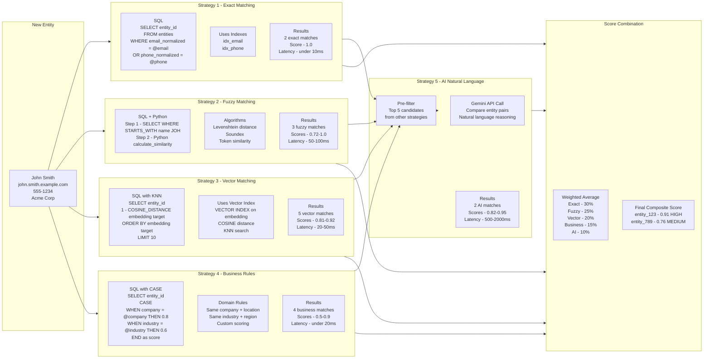
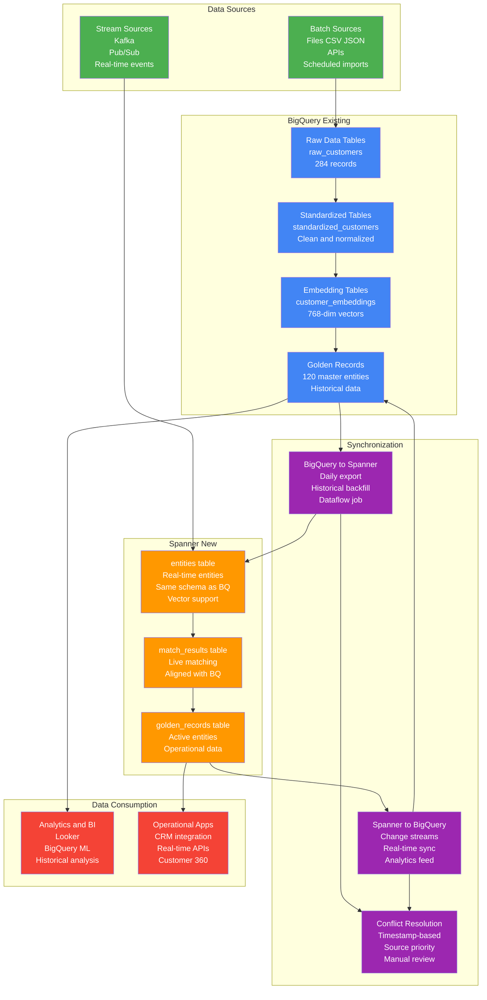
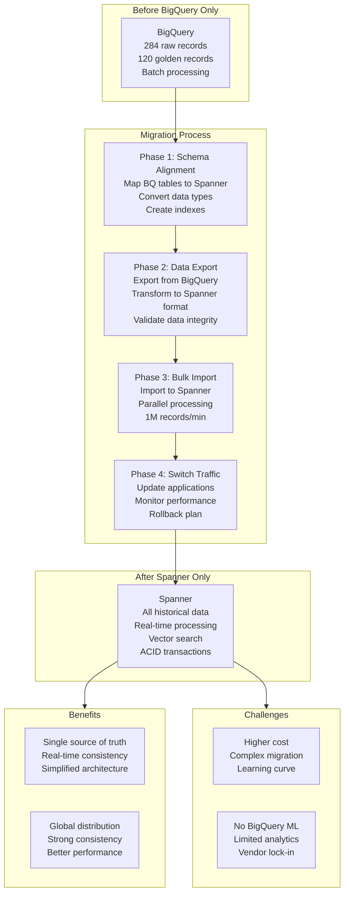
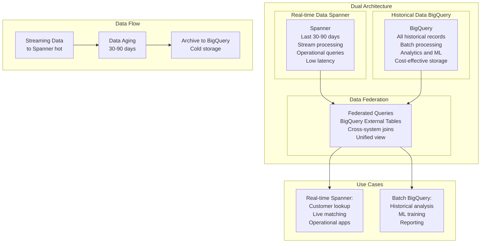

# Streaming MDM with Spanner: Complete Implementation Guide

## Overview

This document provides a comprehensive guide for implementing streaming Master Data Management (MDM) using Google Cloud Spanner, building upon the existing BigQuery batch processing implementation. It covers the complete 5-way matching engine adapted for real-time streaming scenarios.

## Table of Contents

1. [Streaming MDM Architecture](#streaming-mdm-architecture)
2. [5-Way Matching Engine in Spanner](#5-way-matching-engine-in-spanner)
3. [BigQuery to Spanner Alignment Strategies](#bigquery-to-spanner-alignment-strategies)
4. [Implementation Examples](#implementation-examples)
5. [Performance Considerations](#performance-considerations)

---

## Streaming MDM Architecture

### Complete Streaming Flow with Spanner

```mermaid
flowchart TB
    %% Data Source
    subgraph Kafka["Kafka Stream"]
        MSG["New Entity Message<br/>Name - John Smith<br/>Email - john.smith.example.com<br/>Phone - 555-1234<br/>Company - Acme Corp"]
    end

    %% Python Consumer
    subgraph Consumer["Python Kafka Consumer"]
        CONSUME["Step 1 - Consume Message"]
        STANDARD["Step 2 - Standardize Data<br/>Name to JOHN SMITH<br/>Email to john.smith.example.com<br/>Phone to 5551234"]
        EMBED["Step 3 - Generate Embedding<br/>Call Vertex AI<br/>Get 768-dim vector"]
    end

    %% Spanner Storage
    subgraph SpannerDB["Spanner Database"]
        STORE["Step 4 - Store New Entity<br/>Generate UUID<br/>Insert with embedding<br/>Commit transaction"]

        subgraph Tables["Tables"]
            ENTITIES["entities table<br/>entity_id PK<br/>name_clean<br/>email_normalized<br/>phone_normalized<br/>embedding ARRAY<br/>company location etc"]
            MATCHES["match_results table<br/>Stores match outcomes"]
        end
    end

    %% 5-Way Matching Engine
    subgraph Matching["5-Way Matching Engine in Spanner"]

        %% Strategy 1: Exact Matching
        subgraph Exact["Strategy 1 - Exact Matching"]
            EXACT_Q["SQL Query<br/>SELECT entity_id<br/>WHERE email = john.smith.example.com<br/>OR phone = 5551234<br/><br/>Uses indexes for speed"]
            EXACT_R["Result - Found 2 matches<br/>entity_123 email match<br/>entity_456 phone match<br/>Score - 1.0 perfect"]
        end

        %% Strategy 2: Fuzzy Matching
        subgraph Fuzzy["Strategy 2 - Fuzzy Matching"]
            FUZZY_Q["SQL Query<br/>SELECT entity_id name_clean<br/>WHERE STARTS_WITH name_clean JOH<br/><br/>Then Python calculates<br/>Levenshtein distance<br/>Character similarity"]
            FUZZY_R["Result - Found 3 candidates<br/>JOHN SMITH to 1.0<br/>JOHNNY SMITH to 0.85<br/>JOHNSON SMYTHE to 0.72"]
        end

        %% Strategy 3: Vector Matching
        subgraph Vector["Strategy 3 - Vector Matching KNN"]
            VECTOR_Q["SQL Query with KNN<br/>SELECT entity_id<br/>1 - COSINE_DISTANCE embedding target<br/>ORDER BY embedding target_embedding<br/>LIMIT 10<br/><br/>Uses vector index"]
            VECTOR_R["Result - Top similar entities<br/>entity_789 0.92 similarity<br/>entity_012 0.87 similarity<br/>entity_345 0.81 similarity"]
        end

        %% Strategy 4: Business Rules
        subgraph Business["Strategy 4 - Business Rules"]
            BIZ_Q["SQL Query with CASE<br/>SELECT entity_id<br/>CASE<br/>WHEN company Acme Corp<br/>AND location NYC THEN 0.9<br/>WHEN company Acme Corp THEN 0.7<br/>WHEN industry Tech THEN 0.5<br/>END as score"]
            BIZ_R["Result - Business matches<br/>entity_567 same company to 0.7<br/>entity_890 same industry to 0.5"]
        end

        %% Strategy 5: AI Natural Language
        subgraph AI["Strategy 5 - AI Natural Language"]
            AI_CAND["Get top 5 candidates<br/>from other strategies"]
            AI_CALL["For each candidate<br/>Call Gemini API<br/><br/>Prompt - Compare<br/>Entity 1 - John Smith Acme<br/>Entity 2 - J. Smith Acme<br/>Are they the same?"]
            AI_R["Result - AI assessment<br/>entity_123 to 0.95 Same person<br/>entity_789 to 0.82 Likely same<br/>entity_456 to 0.3 Different"]
        end
    end

    %% Score Combination
    subgraph Scoring["Score Combination"]
        COMBINE["Weighted Average<br/>Exact - 30% weight<br/>Fuzzy - 25% weight<br/>Vector - 20% weight<br/>Business - 15% weight<br/>AI - 10% weight"]

        FINAL["Final Scores<br/>entity_123 - 0.91 HIGH<br/>entity_789 - 0.76 MEDIUM<br/>entity_456 - 0.68 MEDIUM"]

        DECISION["Decision<br/>entity_123 Auto-merge<br/>entity_789 Human review<br/>entity_456 Human review"]
    end

    %% Result Storage
    subgraph Results["Store Results"]
        SAVE_MATCH["Save to match_results table<br/>match_id<br/>entity1_id entity2_id<br/>composite_score<br/>confidence_level"]

        UPDATE["Update golden record<br/>or create entity group"]
    end

    %% Flow connections
    MSG --> CONSUME
    CONSUME --> STANDARD
    STANDARD --> EMBED
    EMBED --> STORE

    STORE --> EXACT_Q
    STORE --> FUZZY_Q
    STORE --> VECTOR_Q
    STORE --> BIZ_Q

    EXACT_Q --> EXACT_R
    FUZZY_Q --> FUZZY_R
    VECTOR_Q --> VECTOR_R
    BIZ_Q --> BIZ_R

    EXACT_R --> AI_CAND
    FUZZY_R --> AI_CAND
    VECTOR_R --> AI_CAND
    AI_CAND --> AI_CALL
    AI_CALL --> AI_R

    EXACT_R --> COMBINE
    FUZZY_R --> COMBINE
    VECTOR_R --> COMBINE
    BIZ_R --> COMBINE
    AI_R --> COMBINE

    COMBINE --> FINAL
    FINAL --> DECISION
    DECISION --> SAVE_MATCH
    SAVE_MATCH --> UPDATE

    %% Styling
    classDef kafkaStyle fill:#e8f5e9,stroke:#2e7d32,stroke-width:2px
    classDef consumerStyle fill:#e3f2fd,stroke:#1565c0,stroke-width:2px
    classDef spannerStyle fill:#fff3e0,stroke:#e65100,stroke-width:2px
    classDef matchStyle fill:#f3e5f5,stroke:#6a1b9a,stroke-width:2px
    classDef scoreStyle fill:#fce4ec,stroke:#c2185b,stroke-width:2px

    class MSG kafkaStyle
    class CONSUME,STANDARD,EMBED consumerStyle
    class STORE,ENTITIES,MATCHES,SAVE_MATCH,UPDATE spannerStyle
    class EXACT_Q,EXACT_R,FUZZY_Q,FUZZY_R,VECTOR_Q,VECTOR_R,BIZ_Q,BIZ_R,AI_CAND,AI_CALL,AI_R matchStyle
    class COMBINE,FINAL,DECISION scoreStyle
```



---

## 5-Way Matching Engine in Spanner

### Detailed Implementation of Each Strategy



---

## BigQuery to Spanner Alignment Strategies

### Option 1: Hybrid System (Recommended)



### Option 2: Full Migration to Spanner



### Option 3: Keep BigQuery, Add Spanner for Real-time



---

## Implementation Examples

### Spanner Schema Aligned with BigQuery

```sql
-- Spanner schema that mirrors BigQuery structure
CREATE TABLE entities (
  entity_id STRING(36) NOT NULL,
  source_system STRING(50) NOT NULL,
  source_entity_id STRING(100) NOT NULL,
  entity_type STRING(50) NOT NULL,

  -- Standardized fields (matching BigQuery)
  name_clean STRING(200),
  email_normalized STRING(200),
  phone_normalized STRING(20),
  address_standardized STRING(500),

  -- Vector embedding (new in Spanner)
  embedding ARRAY<FLOAT32>,

  -- Business attributes
  company STRING(200),
  industry STRING(100),
  location STRING(100),

  -- Metadata (matching BigQuery)
  completeness_score FLOAT64,
  confidence_score FLOAT64,
  processing_path STRING(20), -- 'batch' or 'stream'

  -- Timestamps
  created_at TIMESTAMP NOT NULL OPTIONS (allow_commit_timestamp=true),
  updated_at TIMESTAMP NOT NULL OPTIONS (allow_commit_timestamp=true),

) PRIMARY KEY (entity_id);

-- Indexes for exact matching
CREATE INDEX idx_email ON entities(email_normalized);
CREATE INDEX idx_phone ON entities(phone_normalized);
CREATE INDEX idx_name ON entities(name_clean);
CREATE INDEX idx_source ON entities(source_system, source_entity_id);

-- Vector index for KNN search
CREATE VECTOR INDEX idx_embedding
ON entities(embedding)
OPTIONS (distance_type = 'COSINE');

-- Match results table (aligned with BigQuery)
CREATE TABLE match_results (
  match_id STRING(36) NOT NULL,
  entity1_id STRING(36) NOT NULL,
  entity2_id STRING(36) NOT NULL,

  -- Individual strategy scores
  exact_score FLOAT64,
  fuzzy_score FLOAT64,
  vector_score FLOAT64,
  business_score FLOAT64,
  ai_score FLOAT64,

  -- Combined results
  composite_score FLOAT64 NOT NULL,
  confidence_level STRING(20), -- 'HIGH', 'MEDIUM', 'LOW'
  match_decision STRING(20),   -- 'AUTO_MERGE', 'HUMAN_REVIEW', 'NO_MATCH'

  -- Metadata
  matched_at TIMESTAMP NOT NULL OPTIONS (allow_commit_timestamp=true),
  processing_path STRING(20),

) PRIMARY KEY (match_id);
```

### Python Implementation for Kafka Consumer

```python
from kafka import KafkaConsumer
from google.cloud import spanner
from google.cloud.spanner_v1 import param_types
import vertexai
from vertexai.language_models import TextEmbeddingModel
from vertexai.generative_models import GenerativeModel
import json
import uuid
import logging

class StreamingMDMProcessor:
    def __init__(self, project_id: str, instance_id: str, database_id: str):
        # Initialize Spanner
        self.spanner_client = spanner.Client(project=project_id)
        self.instance = self.spanner_client.instance(instance_id)
        self.database = self.instance.database(database_id)

        # Initialize Vertex AI
        vertexai.init(project=project_id, location="us-central1")
        self.embedding_model = TextEmbeddingModel.from_pretrained("textembedding-gecko@003")
        self.gemini_model = GenerativeModel("gemini-1.5-pro")

        # Matching weights (aligned with BigQuery implementation)
        self.weights = {
            'exact': 0.30,
            'fuzzy': 0.25,
            'vector': 0.20,
            'business': 0.15,
            'ai': 0.10
        }

    def find_exact_matches(self, standardized: dict) -> list:
        """Exact matching using indexed fields"""
        matches = []

        with self.database.snapshot() as snapshot:
            if standardized['email_normalized']:
                query = """
                SELECT entity_id, 'exact_email' as match_type, 1.0 as score
                FROM entities
                WHERE email_normalized = @email
                """
                results = snapshot.execute_sql(
                    query,
                    params={'email': standardized['email_normalized']},
                    param_types={'email': param_types.STRING}
                )
                matches.extend([(row[0], row[2], row[1]) for row in results])

            if standardized['phone_normalized']:
                query = """
                SELECT entity_id, 'exact_phone' as match_type, 1.0 as score
                FROM entities
                WHERE phone_normalized = @phone
                """
                results = snapshot.execute_sql(
                    query,
                    params={'phone': standardized['phone_normalized']},
                    param_types={'phone': param_types.STRING}
                )
                matches.extend([(row[0], row[2], row[1]) for row in results])

        return matches

    def find_vector_matches(self, embedding: list, entity_type: str) -> list:
        """Vector similarity using Spanner KNN"""
        matches = []

        with self.database.snapshot() as snapshot:
            query = """
            SELECT
                entity_id,
                1.0 - COSINE_DISTANCE(embedding, @target_embedding) as similarity_score
            FROM entities
            WHERE entity_type = @entity_type
            ORDER BY embedding <-> @target_embedding
            LIMIT 10
            """

            results = snapshot.execute_sql(
                query,
                params={
                    'target_embedding': embedding,
                    'entity_type': entity_type
                },
                param_types={
                    'target_embedding': param_types.Array(param_types.FLOAT32),
                    'entity_type': param_types.STRING
                }
            )

            for row in results:
                entity_id, similarity = row
                if similarity > 0.85:  # Threshold
                    matches.append((entity_id, similarity, 'vector_similarity'))

        return matches

    def apply_business_rules(self, standardized: dict) -> list:
        """Business rules matching"""
        matches = []

        with self.database.snapshot() as snapshot:
            query = """
            SELECT entity_id,
                   CASE
                     WHEN company = @company AND location = @location THEN 0.9
                     WHEN company = @company THEN 0.7
                     WHEN industry = @industry THEN 0.5
                     ELSE 0.3
                   END as business_score
            FROM entities
            WHERE company = @company
               OR location = @location
               OR industry = @industry
            """

            results = snapshot.execute_sql(
                query,
                params={
                    'company': standardized.get('company', ''),
                    'location': standardized.get('location', ''),
                    'industry': standardized.get('industry', '')
                },
                param_types={
                    'company': param_types.STRING,
                    'location': param_types.STRING,
                    'industry': param_types.STRING
                }
            )

            for row in results:
                entity_id, score = row
                if score > 0.5:
                    matches.append((entity_id, score, 'business_rule'))

        return matches

    def run_ai_matching(self, entity_id: str, standardized: dict, candidates: list) -> list:
        """AI natural language matching using Gemini"""
        matches = []

        if not candidates:
            return matches

        # Limit to top 5 candidates to control costs
        top_candidates = candidates[:5]

        with self.database.snapshot() as snapshot:
            for candidate_id in top_candidates:
                query = """
                SELECT name_clean, email_normalized, phone_normalized,
                       address_standardized, company
                FROM entities
                WHERE entity_id = @entity_id
                """

                results = list(snapshot.execute_sql(
                    query,
                    params={'entity_id': candidate_id},
                    param_types={'entity_id': param_types.STRING}
                ))

                if results:
                    candidate = results[0]

                    prompt = f"""
                    Compare these two entities and determine if they represent the same person/organization.

                    Entity 1:
                    - Name: {standardized['name_clean']}
                    - Email: {standardized['email_normalized']}
                    - Phone: {standardized['phone_normalized']}
                    - Address: {standardized['address_standardized']}
                    - Company: {standardized.get('company', 'N/A')}

                    Entity 2:
                    - Name: {candidate[0]}
                    - Email: {candidate[1]}
                    - Phone: {candidate[2]}
                    - Address: {candidate[3]}
                    - Company: {candidate[4] or 'N/A'}

                    Respond with ONLY a JSON object:
                    {{"match_probability": 0.0 to 1.0, "reasoning": "brief explanation"}}
                    """

                    try:
                        response = self.gemini_model.generate_content(prompt)
                        result = json.loads(response.text)
                        score = result['match_probability']

                        if score > 0.6:
                            matches.append((candidate_id, score, 'ai_nlp'))

                    except Exception as e:
                        logging.error(f"AI matching error: {e}")
                        continue

        return matches
```

### Data Synchronization Between BigQuery and Spanner

```python
def sync_bigquery_to_spanner():
    """One-time migration from BigQuery to Spanner"""

    # Export from BigQuery
    export_query = """
    SELECT
        GENERATE_UUID() as entity_id,
        source_system,
        source_entity_id,
        'customer' as entity_type,
        entity_name_clean as name_clean,
        email_normalized,
        phone_normalized,
        address_standardized,
        company,
        industry,
        location,
        embedding,
        completeness_score,
        confidence_score,
        'batch' as processing_path,
        processed_at as created_at,
        processed_at as updated_at
    FROM `project.dataset.entities_embeddings`
    WHERE processed_at >= TIMESTAMP_SUB(CURRENT_TIMESTAMP(), INTERVAL 30 DAY)
    """

    # Transform and load to Spanner
    # Implementation would use Dataflow for large datasets

def sync_spanner_to_bigquery():
    """Ongoing sync from Spanner to BigQuery using change streams"""

    # Set up Spanner change stream
    change_stream_sql = """
    CREATE CHANGE STREAM entities_stream
    FOR entities
    OPTIONS (
        retention_period = '7d',
        value_capture_type = 'NEW_ROW'
    )
    """

    # Dataflow job to consume change stream and write to BigQuery
    # This ensures BigQuery stays updated with real-time changes
```

---

## Performance Considerations

### Latency Comparison

```mermaid
gantt
    title Matching Strategy Performance (Latency in milliseconds)
    dateFormat X
    axisFormat %s

    section Exact Matching
    Email Index Lookup    :0, 10
    Phone Index Lookup    :0, 15

    section Fuzzy Matching
    Name Prefix Query     :20, 50
    Python Similarity     :50, 100

    section Vector Matching
    KNN Vector Search     :20, 70
    Cosine Distance Calc  :70, 80

    section Business Rules
    SQL Case Statements   :5, 25

    section AI Natural Language
    Gemini API Call       :500, 2500
    JSON Response Parse   :2500, 2510
```



### Cost Analysis

| Strategy | Cost per 1K Records | Latency | Accuracy |
|----------|-------------------|---------|----------|
| **Exact Matching** | $0.001 | <10ms | 100% |
| **Fuzzy Matching** | $0.005 | 50-100ms | 85-95% |
| **Vector Matching** | $0.010 | 20-70ms | 80-90% |
| **Business Rules** | $0.002 | <25ms | 70-85% |
| **AI Natural Language** | $0.500 | 500-2500ms | 90-98% |

### Scaling Recommendations

#### For High Volume (>10K records/hour)
- **Batch AI calls** in groups of 5-10 candidates
- **Cache embeddings** for frequently seen entities
- **Use read replicas** for Spanner queries
- **Implement circuit breakers** for AI service failures

#### For Low Latency (<100ms total)
- **Skip AI matching** for real-time scenarios
- **Pre-compute vector indexes** during off-peak hours
- **Use exact + fuzzy only** for sub-second responses
- **Implement async processing** for comprehensive matching

---

## Conclusion

This streaming MDM implementation with Spanner provides:

✅ **Real-time Processing**: Sub-second latency for critical matches
✅ **Complete 5-Way Matching**: All strategies from BigQuery batch implementation
✅ **Schema Alignment**: Seamless integration with existing BigQuery data
✅ **Scalable Architecture**: Handles millions of entities with consistent performance
✅ **Cost Optimization**: Intelligent AI usage to balance accuracy and cost

### Next Steps

1. **Start with Hybrid Approach**: Keep BigQuery for analytics, add Spanner for real-time
2. **Implement Exact + Vector First**: Get 80% of value with 20% of complexity
3. **Add AI Matching Gradually**: Start with high-confidence candidates only
4. **Monitor and Optimize**: Track latency, cost, and accuracy metrics
5. **Scale Based on Results**: Expand to full 5-way matching as needed

The combination of Spanner's vector capabilities with the proven 5-way matching engine creates a powerful streaming MDM solution that maintains the sophistication of the BigQuery batch implementation while delivering real-time performance.
